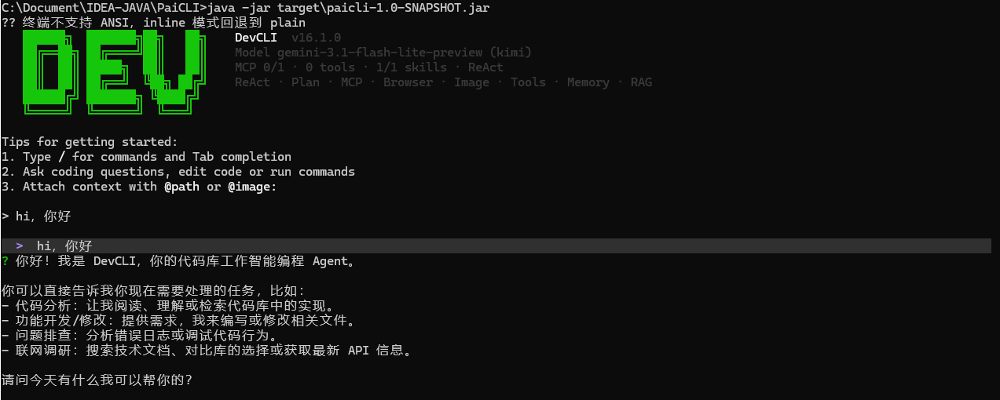

# DevCLI

[](https://github.com/shawns-yao/DevCLI/actions/workflows/ci.yml)



DevCLI 是一个面向 Java 后端开发者的终端 Agent CLI。它可以在命令行中通过自然语言驱动代码阅读、生成、调试、重构、命令执行和仓库检索。

核心能力：

- ReAct（推理-行动）主循环：支持多轮工具调用、结果回灌和流式输出。
- Plan-and-Execute（规划执行）：通过 `/plan` 生成任务计划并按依赖执行。
- Multi-Agent（多智能体）：通过 `/team` 使用 Planner / Worker / Reviewer 协作执行复杂任务。
- RAG（检索增强生成）：基于 JavaParser、SQLite 向量存储、关键词召回、代码关系图谱、RRF（倒数排名融合）和 CrossEncoderReranker（交叉编码器重排）检索仓库实现。
- Memory（记忆）：支持当前会话工作记忆、长期记忆、强约束记忆，以及绑定 SymbolVersion（符号版本）的 RAG 证据记忆。
- MCP（Model Context Protocol）：可接入外部 MCP server，动态注册工具和 resources。
- Skill：支持 jar 内置、用户级和项目级 Skill；frontmatter 可声明 allowedTools、context 和 paths，按当前任务路径筛选并按使用频率排序。
- HITL（Human-in-the-Loop）：危险操作可开启人工审批、路径限制和审计日志。
- Browser / Web：支持 web_search、web_fetch，以及 Chrome DevTools MCP 浏览器操作。
- Image Input（图片输入）：支持本地图片和剪贴板图片作为模型输入。

## Feature Overview

DevCLI 的目标不是做一个普通聊天壳，而是把“模型、工具、代码仓库、记忆、审批、终端交互”串成一个本地开发工作流。核心执行路径分三类：

- `ReAct`：默认模式。模型边思考边选择工具，工具结果会回灌到下一轮推理，适合阅读代码、定位问题、执行命令、做小范围修改。
- `Plan-and-Execute`：通过 `/plan` 进入。Planner 先拆任务和依赖，再按 DAG（有向无环图）执行，适合多步骤改造、跨文件修复、需要先审计划的任务。
- `Multi-Agent`：通过 `/team` 进入。Planner 负责拆解和验收标准，Worker 执行具体子任务，Reviewer 在硬检查通过后做质量审查，适合复杂任务和需要并行推进的工作。

围绕这三条路径，DevCLI 提供以下能力：

- `ToolRegistry（工具注册表）`：统一管理内置工具、MCP 动态工具和 resource 读取工具；所有工具调用都走 JSON Schema 参数校验、HITL、策略层和审计链。
- `RAG（检索增强生成）`：用 JavaParser 切分 Java 代码，结合 SQLite 向量存储、关键词召回、代码关系图谱、RRF（倒数排名融合）、symbol-aware boost（符号感知加权）和 CrossEncoderReranker（交叉编码器重排），把相关类、方法、调用链注入模型上下文。
- `Memory（记忆）`：区分对话历史、工作记忆、长期记忆和强约束记忆。长期记忆写入前经过规则化写入策略，避免把临时闲聊、敏感信息或低复用事实写入持久层。
- `Prompt（提示词分层）`：base、personality、mode、approval、project_context、skills、context_mgmt、handoff 分层组装，支持 jar 内置、用户级和项目级覆盖。
- `Skill（技能）`：`load_skill` 按需加载完整指引；已加载 Skill 的允许工具白名单会限制后续工具调用，压缩后恢复保留 context、allowedTools 和内容摘要。
- `MCP（Model Context Protocol）`：支持 stdio / streamable HTTP MCP server，动态加载工具和 resources，并把 MCP server 状态、日志、重启能力暴露给 CLI。
- `HITL（Human-in-the-Loop）`：危险工具和敏感页面操作进入人工审批；审批前先过策略层，策略拒绝的操作不能靠用户批准绕过。
- `Snapshot（快照）`：通过 Side-Git 在 turn 前后保存快照，支持回滚最近一轮变更，降低 Agent 自动改文件的风险。
- `Renderer（渲染器）`：默认 inline 模式提供底部状态栏、行内 thinking、工具块和 diff；也保留 plain 和 Lanterna TUI 模式。
- `Runtime API`：本地 HTTP API 暴露 threads / turns / events，便于外部进程把 DevCLI 当作本地 Agent runtime 调用。
- `Image Input`：支持 `@image:` 本地路径、file URL 和剪贴板图片，图片会做尺寸、格式和大小处理后进入模型输入。

## Architecture

主执行链路：

```text
Main
├── Agent                  # 默认 ReAct
├── PlanExecuteAgent       # /plan
└── AgentOrchestrator      # /team

三条路径共享：
├── ToolRegistry           # 内置工具 + MCP 工具 + resources
├── MemoryManager          # WorkingMemory + LongTermMemory + StickyMemory
├── SnapshotService        # turn 前后快照
├── PromptAssembler        # 分层 prompt 组装
├── Renderer               # inline / plain / lanterna
└── McpServerManager       # MCP server 生命周期
```

关键边界：

- `ConversationHistoryCompactor（对话历史压缩器）` 是治理 LLM messages 窗口的唯一压缩点；压缩分两层：第 0 层 `microcompact` 先把单条超大消息（多为大工具结果）头尾截断，并把最近 2 个 user round 之前的旧 `tool_result` 按 `toolCallId` 成批落盘为 `<microcompact_boundary>` 引用（不调 LLM、不删消息、保 tool_call 配对），扛不住再走 LLM 摘要（Map-Reduce / 增量）。摘要为固定九段结构化（对标 Claude Code `/compact` 模板），超长时先程序化 GC（按段裁剪、不调 LLM），不够再 LLM 兜底。
- `WorkingMemory（工作记忆）` 只保存当前会话派生状态，不承担压缩职责。`RagEvidenceMemory（RAG 证据记忆）` 会记录检索证据的 `IndexEpoch（索引版本）`、`SymbolVersion（符号版本）` 和 `ClasspathEpoch（类路径版本）`。
- `LongTermMemory（长期记忆）` 只保存跨会话稳定事实，默认不把临时任务请求写入长期层。`SymbolInvalidation（符号失效）` 会在索引替换时记录旧/新符号版本差异，并通过 `NegativeFact（负向事实）` 告诉模型哪些旧事实不可用。
- `PathGuard（路径围栏）` 负责限制文件访问不逃逸项目根。
- `ResourceLeaseManager（资源租约管理器）` 在 `/plan` 和 `/team` 并行执行时拦截 `write_file`，同一文件只能被一个运行中 task / step 写入，避免运行时新增文件写入目标导致互相覆盖。
- `CommandGuard（命令防线）` 是危险命令快速拒绝层，不替代 HITL 和路径策略。
- `HitlToolRegistry（审批工具注册表）` 位于真实工具执行前，保证危险操作先经过审批和策略判定。

## Requirements

- Java 17+
- Maven 3.8+
- Node.js / npm，只有使用默认 Chrome DevTools MCP 时需要
- 至少一个 LLM API Key；默认 provider 是 Anthropic Messages 原生接口：
  - `ANTHROPIC_AUTH_TOKEN`（Claude / Anthropic Messages 兼容端点，可配 `ANTHROPIC_BASE_URL` / `ANTHROPIC_MODEL`）
  - `OPENAI_API_KEY`（OpenAI 官方或兼容端点，可配 `OPENAI_BASE_URL` / `OPENAI_MODEL`）
  - `GLM_API_KEY`
  - `DEEPSEEK_API_KEY`
  - `STEP_API_KEY`
  - `KIMI_API_KEY` 或 `MOONSHOT_API_KEY`

Embedding（向量检索）默认使用 Ollama：

- Ollama 本地服务：`http://localhost:11434`
- 默认模型：`nomic-embed-text:latest`

如果不使用本地 Ollama，可以在 `.env` 中配置远程 embedding provider。

RAG 检索默认使用 keyword + semantic + bounded graph 的 RRF（倒数排名融合），再叠加 symbol-aware boost（符号感知加权），最后调用
Cross-Encoder（交叉编码器）做二阶段 rerank。默认 rerank endpoint 是本地 Docker
暴露的 `http://localhost:8000/v1/rerank`；不可用时会自动降级回 RRF 结果。

## Install

克隆仓库：

```bash
git clone https://github.com/shawns-yao/DevCLI.git
cd DevCLI
```

复制配置文件：

```bash
cp .env.example .env
```

编辑 `.env`，默认填写 Anthropic Messages 配置：

```bash
ANTHROPIC_AUTH_TOKEN=your_api_key_here
ANTHROPIC_BASE_URL=https://api.anthropic.com
ANTHROPIC_MODEL=claude-sonnet-4-20250514
```

也可以改填 `OPENAI_API_KEY`、`GLM_API_KEY`、`DEEPSEEK_API_KEY`、`STEP_API_KEY` 或 `KIMI_API_KEY`，运行时用 `/model` 切换 provider。

如果使用默认本地 embedding：

```bash
ollama pull nomic-embed-text:latest
ollama serve
```

构建 jar：

```bash
mvn clean package
```

运行命令：

```bash
java -jar target/devcli-1.0-SNAPSHOT.jar
```

也可以直接用 Maven 启动：

```bash
mvn clean compile exec:java -Dexec.mainClass="com.devcli.cli.Main"
```

## Startup

启动后会进入交互式终端。README 中展示的品牌输出使用 DevCLI：

```text
██████╗  ███████╗██╗   ██╗
██╔══██╗ ██╔════╝██║   ██║
██║  ██║ █████╗  ██║   ██║    DevCLI
██║  ██║ ██╔══╝  ╚██╗ ██╔╝    ReAct · Plan · Team · MCP · RAG
██████╔╝ ███████╗ ╚████╔╝
╚═════╝  ╚══════╝  ╚═══╝

Tips for getting started:
1. Type / for commands and Tab completion
2. Ask coding questions, edit code or run commands
3. Attach context with @path or @image:

* 你好

> 你好
DevCLI: 你好，我在。可以直接描述要阅读、修改或运行的任务。
```

## Configuration

### LLM

DevCLI 会从 `.env` 或系统环境变量读取模型配置。

常用配置：

```bash
ANTHROPIC_AUTH_TOKEN=your_api_key_here
ANTHROPIC_BASE_URL=https://api.anthropic.com
ANTHROPIC_MODEL=claude-sonnet-4-20250514

OPENAI_API_KEY=your_api_key_here
OPENAI_MODEL=gpt-4o
OPENAI_BASE_URL=https://api.openai.com/v1
# 中转站如要求渠道/分组，可选配
OPENAI_CHANNEL=Other
OPENAI_GROUP=Other

GLM_API_KEY=your_api_key_here
GLM_MODEL=glm-5.1

DEEPSEEK_API_KEY=your_api_key_here
DEEPSEEK_MODEL=deepseek-v4-flash

STEP_API_KEY=your_api_key_here
STEP_MODEL=step-3.5-flash

KIMI_API_KEY=your_api_key_here
KIMI_MODEL=kimi-k2.6
```

未显式切换时默认使用 `anthropic` provider；运行时可用 `/model` 切换已配置的 provider。

### Embedding

默认：

```bash
EMBEDDING_PROVIDER=ollama
EMBEDDING_MODEL=nomic-embed-text:latest
EMBEDDING_BASE_URL=http://localhost:11434
```

如果使用远程 embedding 服务：

```bash
EMBEDDING_PROVIDER=openai
EMBEDDING_MODEL=text-embedding-3-small
EMBEDDING_BASE_URL=https://api.openai.com/v1
EMBEDDING_API_KEY=your_api_key_here
```

### Rerank

默认：

```bash
RERANK_ENABLED=true
RERANK_PROVIDER=openai
RERANK_MODEL=BAAI/bge-reranker-v2-m3
RERANK_BASE_URL=http://localhost:8000/v1
```

如果本地 Docker rerank 服务不可用，检索会降级到 RRF 结果，不中断 Agent。

### Web Search

支持 `zhipu`、`serpapi`、`searxng`：

```bash
SEARCH_PROVIDER=zhipu
ZHIPU_SEARCH_ENGINE=search_std

# 或
SERPAPI_KEY=your_serpapi_key_here

# 或
SEARXNG_URL=http://localhost:8888
```

### MCP

MCP 配置文件：

- 用户级：`~/.devcli/mcp.json`
- 项目级：`.devcli/mcp.json`

DevCLI 在默认配置缺失时会创建 Chrome DevTools MCP 示例配置：

```json
{
  "mcpServers": {
    "chrome-devtools": {
      "command": "npx",
      "args": ["-y", "chrome-devtools-mcp@latest", "--isolated=true"]
    }
  }
}
```

手动配置远程 MCP server 示例：

```json
{
  "mcpServers": {
    "remote": {
      "url": "https://example.com/mcp",
      "headers": {
        "Authorization": "Bearer ${REMOTE_TOKEN}"
      }
    }
  }
}
```

### Renderer

默认使用 inline 流式终端界面：

```bash
DEVCLI_RENDERER=inline
```

可选值：

- `inline`：默认，底部状态栏、行内工具块、行内 diff。
- `lanterna`：三栏全屏 TUI。
- `plain`：纯文本输出。

如果终端不支持底部状态栏：

```bash
DEVCLI_NO_STATUSBAR=true
```

### Runtime API

DevCLI 可以以本地 Runtime API 方式启动：

```bash
DEVCLI_RUNTIME_API_KEY=your_local_api_key \
java -jar target/devcli-1.0-SNAPSHOT.jar serve --http --port 8080
```

请求头：

```text
Authorization: Bearer your_local_api_key
```

Runtime API 默认仅绑定 `127.0.0.1`。HTTP 请求线程和 Agent 执行线程隔离；Agent 执行池默认 `2` 个线程、队列 `64`，可通过
`-Ddevcli.runtime.api.turn.threads` / `-Ddevcli.runtime.api.turn.queue` 调整。队列满时返回 `429 {"error":"runtime_busy"}`。

## Usage

启动后直接输入自然语言任务：

```text
* 帮我阅读这个项目的启动入口，并说明主要执行流程
```

让 Agent 修改代码：

```text
* 修复 UserService 中空指针问题，并补充对应单元测试
```

附加本地文件或目录上下文：

```text
* 阅读 @src/main/java/com/example/UserService.java，找出潜在 bug
* 根据 @docs/api.md 更新 Controller 参数校验
```

附加图片：

```text
* 分析 @image:/absolute/path/screenshot.png 里的报错
```

进入 Plan-and-Execute：

```text
/plan 重构订单模块，把校验逻辑从 Controller 下沉到 Service，并补充测试
```

进入 Multi-Agent：

```text
/team 检查认证模块的安全问题，修复高风险项并补充测试
```

Multi-Agent：Planner 拆 DAG 并提取 `acceptance_criteria`，Worker 做实现，Reviewer 做硬检查后的质量审查。验收点会前置注入 Worker，并由 Reviewer 用 `criteria_results` 逐条验证；critical/high 失败或缺少覆盖强制不通过。三角色注入 role-scoped WorkingMemory：Planner 看任务状态 + 关键事件，Worker 看完整上下文，Reviewer 看任务状态 + 工具证据。Reviewer 前会自动执行 Java 编译硬检查，失败直接打回；Reviewer JSON 采用 `functional_correctness` / `integration_completeness` / `code_quality` 三层评分，未达阈值强制不通过。

并行 Worker 数量默认 `2`，可通过 `DEVCLI_TEAM_WORKERS` 环境变量或 `-Ddevcli.team.workers` 系统属性调整（取值夹在 `[1, 8]`，非法值回退默认）。同一依赖批次内相互独立的步骤会按 Worker 池大小并行执行。

失败恢复采用「在位重做」而非平行重规划：失败步骤保持原 id/依赖在 DAG 原位换思路重做（默认 1 次，带上次失败反馈），恢复始终长在原 DAG 上、通过依赖关系看到已完成成果，从机制上避免「新计划与已落盘成果冲突」；redo 用尽仍失败则保持失败终态。代码开发有副作用（write_file 已落盘），所以 write_file/execute_command 的工具证据在工作记忆中优先保留、不被只读操作挤出，使后续步骤持续看到本会话改过哪些文件，在真实现状上工作。

常见任务写法：

```text
* 找出登录接口的完整调用链，并指出鉴权在哪里发生
* 检查最近一次改动有没有引入空指针、路径逃逸或命令执行风险
* 根据 @README.md 和 @src/main/java/com/devcli/cli/Main.java 更新启动说明
* 运行相关测试，失败时定位根因并修复
* 分析 @image:C:/tmp/error.png 中的报错截图，并给出修复路径
```

如果输入以 `/` 开头，CLI 会优先按命令解析；未识别命令会在 CLI 层报错，不回退给 Agent 当自然语言执行。

## Commands

常用命令：

| Command | Description |
|---------|-------------|
| `/help` | 查看帮助 |
| `/model` | 查看或切换模型 |
| `/plan` | 使用 Plan-and-Execute 执行下一条任务 |
| `/team` | 使用 Multi-Agent 协作执行任务 |
| `/team resume [id]` | 从 checkpoint 恢复中断的多 Agent 任务 |
| `/index` | 为当前仓库建立 RAG 索引 |
| `/search <query>` | 检索代码库 |
| `/graph <class>` | 查看代码关系图谱 |
| `/memory` | 查看记忆状态 |
| `/memory clear` | 清空长期记忆 |
| `/save <fact>` | 保存长期事实 |
| `/save --pin <fact>` | 保存强约束事实，每轮全量注入 |
| `/mcp` | 查看 MCP server 状态 |
| `/mcp restart <name>` | 重启 MCP server |
| `/mcp logs <name>` | 查看 MCP server stderr 日志 |
| `/hitl on` | 开启人工审批 |
| `/hitl off` | 关闭人工审批 |
| `/policy` | 查看策略层状态 |
| `/audit [N]` | 查看最近 N 条审计日志 |
| `/snapshot` | 查看 Side-Git 快照状态 |
| `/browser connect` | 连接可复用 Chrome 会话 |
| `/clear` | 清空当前对话 |
| `/exit` | 退出 |

命令补全：

- `/model` 支持 provider 补全。
- `/mcp` 支持 server 名称和子命令补全。
- `/skill` 支持 skill 名称和子命令补全。
- `@path` 支持本地文件、目录和 MCP resource mention 补全。
- `@image:` 支持本地图片路径补全。

## Built-in Tools

内置工具：

| Tool | Description |
|------|-------------|
| `read_file` | 读取文件 |
| `write_file` | 写入文件 |
| `list_dir` | 列出目录 |
| `execute_command` | 执行短时 shell 命令 |
| `create_project` | 创建基础项目结构 |
| `search_code` | 检索代码库 |
| `web_search` | 搜索互联网 |
| `web_fetch` | 抓取已知 URL 并提取正文 |
| `save_memory` | 保存长期记忆 |
| `list_memory` | 只读列出长期记忆 |
| `revert_turn` | 回滚最近 turn 的改动 |
| `mcp__{server}__{tool}` | MCP server 动态工具 |
| `mcp__{server}__read_resource` | 读取 MCP resource |

同一轮模型返回多个工具调用时，DevCLI 会并行执行可并行的工具，并按原始顺序把结果回灌给模型。

工具调用可靠性：工具定义以 JSON Schema 约束参数类型、必填项、枚举值和未知字段；`ToolRegistry` 在真实执行前通过 `json-schema-validator` + 本地兜底校验内置工具与 MCP 工具参数，非法 JSON、类型错误、空必填、非法枚举、pattern/minimum 等 schema 约束失败会以 `工具参数校验失败` 回传给模型修正。危险工具仍走 HITL 审批、策略拦截和 AuditLog；工具错误会回灌给模型继续纠偏，最终答复必须基于工具证据。

工具边界：

- `read_file` / `write_file` 必须通过路径策略校验。
- `execute_command` 面向短时命令，不适合托管长期后台服务。
- `web_fetch` 适合已知 URL；遇到 SPA 或防爬限制时再切浏览器/MCP。
- `create_project` 只创建基础模板，不替代完整脚手架。
- MCP 工具名统一暴露为 `mcp__{server}__{tool}`，resource 读取暴露为虚拟工具。

## Memory

DevCLI 的上下文分为四层：

- `ConversationHistory（对话历史）`：真实 LLM messages，由压缩器治理窗口。
- `WorkingMemory（工作记忆）`：当前会话工具证据、任务状态和临时事实，不跨会话持久化。其中 `TaskLedger（任务账本）` 结构化记录计划执行进度（当前 step / 已完成 / 待执行 / 失败），不进对话历史、压缩不触碰它，让长 plan 压缩后仍能看到进度；当前由 `/plan`（PlanExecuteAgent）维护。压缩后恢复上下文会按最近读写文件、未完成子任务状态、关键工具结果引用、RAG 证据 epoch 和 MCP 工具状态分节注入，并做预算控制与行级去重；microcompact 工具引用会按 storedPath / toolCallId 去重；Multi-Agent 会按 Planner / Worker / Reviewer 裁剪恢复内容，避免恢复段重复携带完整工具输出。压缩边界会同时记录全局 RAG 索引版本和当前会话 RAG 证据版本。
- `SessionMemory（会话预摘要）`：当前进程内缓存压缩前置摘要，覆盖同一消息指纹且未过期时可被压缩器复用；默认 30 分钟过期。Plan / Multi-Agent turn 结束后会后台维护预摘要，避免主流程等待摘要 LLM 调用。
- `LongTermMemory（长期记忆）`：跨会话稳定事实，SQLite 持久化，支持检索注入；写入前经过 `LongTermMemoryPolicy` 规则化分流，显式低敏偏好/项目事实、稳定个人属性和多次重复出现的稳定事实可保存，敏感或模糊新事实要求确认，临时闲聊和低复用信息跳过。命中 `subject（主题键）` 的事实写入时，同主题旧事实自动标记为 `superseded（已取代）`，检索只返回 `active（有效）` 条目（如 Fastjson → Jackson 选型切换）。
- `StickyMemory（强约束记忆）`：通过 `/save --pin` 保存，每轮全量注入 system prompt。

保存长期事实：

```text
/save 这个项目使用 Java 17
```

保存强约束：

```text
/save --pin 默认用简体中文回答
```

长期记忆写入策略：

- 用户明确说“记住”“保存”“以后记得”时，低敏稳定事实优先保存。
- 个人偏好、项目约定、常用路径、长期身份属性通过 `reason_code` 记录可解释写入原因，不再依赖未校准的小数打分。
- 个人属性类键值事实（如“我是医生”）可自动进入长期记忆；模糊的新个人状态事实（如“我刚刚搬到北京”）需要确认。
- 当信息涉及 token、密码、手机号、地址等敏感内容时，默认要求确认或跳过。
- “今天临时这样做”“这次先用某个文件名”等低复用信息只留在 WorkingMemory。
- 多次在短期上下文重复出现的稳定事实，会提高进入长期记忆的优先级。
- 命中主题键（如 JSON 库选型）的新事实写入时，同主题旧事实自动失效、检索不再召回，避免被推翻的旧设定继续误导模型；抽不到主题则退回追加不覆盖。

## RAG

初始化代码索引：

```text
/index
```

检索代码：

```text
/search 订单创建流程在哪里
```

查看代码关系：

```text
/graph OrderService
```

`search_code` 支持以下模式：

- `auto`
- `general`
- `call_chain`
- `definition`
- `error_trace`
- `config`

调用链场景可设置 `graph_depth`，范围 `0-3`。

RAG 索引内容：

- Java 类、方法、字段、注解、import 和包名。
- 方法体文本和关键上下文片段。
- 调用关系、实现关系、继承关系和依赖关系。
- 文件路径、起止行号、chunk 名称、语义向量、`IndexEpoch（索引版本）`、`SymbolVersion（符号版本）` 和 `ClasspathEpoch（类路径版本）`。

RAG 检索流程：

1. 根据 query 选择 `auto/general/call_chain/definition/error_trace/config` 模式。
2. 语义向量召回候选代码块。
3. 关键词和路径信号补充召回。
4. 需要调用链时扩展代码关系图谱。
5. 使用 RRF（倒数排名融合）合并多路结果，并叠加 symbol-aware boost（符号感知加权）。
6. 默认调用 CrossEncoderReranker（交叉编码器重排）做二阶段排序；服务不可用时保留 RRF 结果。

如果 embedding 服务不可用，DevCLI 会把语义召回降级为空、保留关键词和结构化检索路径继续融合，
不让整条检索失败；并在 `search_code` 结果开头显式标注"语义检索服务不可用，本次已降级"，
不把降级结果伪装成完整 RAG。

## MCP

MCP server 启动后会动态刷新工具和 resources：

- `stdio` server 通过本地命令启动。
- `streamable_http` server 通过远程 HTTP 地址连接。
- server 启动默认不阻塞首屏超过配置的等待时间；超时 server 会保持 `STARTING` 并在后台继续初始化。
- MCP 工具快照按 server 记录工具数量、schema 指纹和生命周期版本；server 启动成功或 tools/list_changed 刷新会推进生命周期版本。
- `/mcp` 可以查看状态，`/mcp logs <name>` 可以查看 stderr，`/mcp restart <name>` 可以重启指定 server。

MCP 安全边界：

- 动态工具同样进入 JSON Schema 参数校验。
- 敏感工具进入 HITL 审批。
- 策略层拒绝优先级高于用户批准。
- MCP resource mention 展开前会经过资源缓存和读取工具。

## Runtime API

Runtime API 适合把 DevCLI 接入本地脚本、编辑器插件或自动化系统。当前提供三个端点：

| Endpoint | Method | Description |
|----------|--------|-------------|
| `/v1/threads` | `POST` | 创建 thread |
| `/v1/threads/{id}/turns` | `POST` | 提交一轮 Agent 输入，异步执行 |
| `/v1/threads/{id}/events` | `GET` | 以 SSE 格式回放事件 |

事件类型：

- `turn.started`
- `message.delta`
- `turn.completed`
- `turn.failed`
- `turn.rejected`

默认只绑定本机地址 `127.0.0.1`，并要求 API Key。HTTP 请求线程与 Agent turn 执行线程隔离，turn 队列满时返回 `429 runtime_busy`。

同一 thread 的多个 turn 有上下文延续：每个 turn 仍然新建独立 Agent 保持隔离，但执行前会从 SQLite 事件流重放该 thread 最近的历史输入/输出对（最多 20 轮，超长窗口由对话压缩器治理）。历史持久化在磁盘，进程重启后上下文不丢失；失败或被拒的 turn 不进入历史。

## Safety

DevCLI 是本地 Agent CLI，不提供容器或虚拟机级沙箱。安全机制包括：

- HITL（人工审批）
- PathGuard（路径围栏）
- CommandGuard（危险命令快速拒绝）
- AuditLog（审计日志）
- Side-Git snapshot（回滚快照）

开启 HITL：

```text
/hitl on
```

查看审计：

```text
/audit 20
```

安全执行顺序：

```text
LLM tool call
→ JSON Schema 参数校验
→ HitlToolRegistry
→ ToolRegistry
→ PathGuard / CommandGuard
→ AuditLog
→ 实际工具执行
```

这意味着：

- 参数不合法时不会进入审批，更不会执行。
- 用户不能批准策略层已经拒绝的操作。
- 文件写入和命令执行会留下审计记录。
- Side-Git snapshot 可用于回滚最近 turn 的文件改动。

## Renderer And Interaction

默认 inline renderer 面向日常终端使用：

- 启动首屏展示模型、MCP、Skill、ReAct 状态和 getting-started tips。
- 输入行支持 slash 命令、`@path`、`@image:`、敏感词和危险 shell 片段高亮。
- 底部状态栏显示当前 phase、模型、上下文百分比、token、cost、elapsed、cwd。
- LLM reasoning 会进入 live thinking 区，正文输出前会收敛为完整引用块。
- 工具调用以紧凑块展示，文件写入会展示 diff。

Lanterna renderer 保留为全屏三栏 TUI；plain renderer 适合 CI、日志或不支持 ANSI 的终端。

## Tests

常规快速回归：

```bash
mvn test -Pquick
```

针对性测试：

```bash
mvn test -Dtest=AgentOrchestratorTest -DskipTests=false
```

全量测试：

```bash
mvn test -DskipTests=false
```

默认 `mvn clean package` 会跳过测试，优先产出可手工验收的 jar。

## Project Layout

```text
src/main/java/com/devcli/
├── agent/       Agent, PlanExecuteAgent, SubAgent, AgentOrchestrator
├── cli/         Main, CliCommandParser
├── context/     ContextProfile, ContextMode, TokenUsageFormatter
├── memory/      MemoryManager, WorkingMemory, LongTermMemory, StickyMemory
├── mcp/         McpServerManager, McpClient, resources, transport
├── plan/        Planner, ExecutionPlan, Task
├── policy/      PathGuard, CommandGuard, AuditLog
├── prompt/      PromptAssembler, PromptContext
├── rag/         CodeIndex, CodeRetriever, VectorStore, CodeChunker
├── render/      Renderer, InlineRenderer, PlainRenderer
├── snapshot/    SideGitManager, SnapshotService
├── tool/        ToolRegistry
└── web/         SearchProvider, WebFetcher, HtmlExtractor
```
