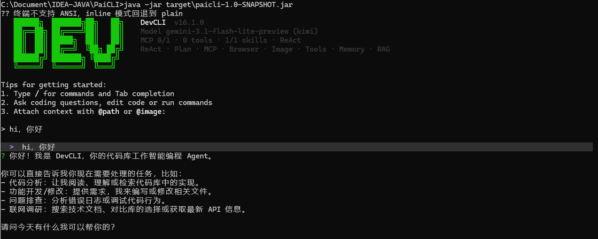

# DevCLI

[](https://github.com/shawns-yao/DevCLI/actions/workflows/ci.yml)



DevCLI 是一个面向 Java 后端开发者的终端 Agent CLI。它可以在命令行中通过自然语言驱动代码阅读、生成、调试、重构、命令执行和仓库检索。

ReAct 主循环、Plan-and-Execute、Multi-Agent 编排、MCP 协议客户端、上下文压缩、RAG 检索与终端渲染全部自行实现，不依赖 Spring AI、LangChain4j 等 Agent 框架。

## Project Snapshot

| 项 | 数值 |
| --- | --- |
| 主源码 | 308 个文件 / 51,683 行，26 个顶层模块 |
| 测试 | 232 个文件 / 34,510 行，1344 个用例全部通过 |
| 语言与构建 | Java 17 + Maven，产出单一可执行 jar |
| 迭代 | 230 次提交（2026-04 起） |

三项量化结果：

- **上下文成本**：修正 system prompt 易变段导致的前缀缓存失效后，13 轮迭代会话的可复用前缀占比由 29.4% 提升到 87.3%，未命中输入下降约 5.5 倍（基于内置 token 估算器的结构性测算，非计费账单）。
- **检索质量**：CodeSearchNet Java 公开集 50 条样本上 Recall@5 1.0000、MRR@5 0.9900、nDCG@5 0.9926。
- **协作模式对照**：单 Agent 与 Planner/Worker/Reviewer 的优劣随任务可拆分性反转。不可拆分的短 CLI 任务上单 Agent 通过 3/5、协作模式 1/5；可拆分的订单履约 Saga 多模块场景上协作模式通过 30/30、单 Agent 27/30，代价是 3.76 倍耗时。

评测使用固定版本公开数据集与受控任务，公开集与项目内任务分开报告。部分场景样本量较小，只用于验证链路与方法，不外推为榜单成绩；完整方法、命令与适用边界见 [Benchmark Evaluation](#benchmark-evaluation)。

安装与启动见 [Install](#install) 与 [Startup](#startup)。

## Implementation Status

**已实现**

- ReAct 主循环、Plan-and-Execute、Multi-Agent（Planner / Worker / Reviewer）三条执行路径，共用取消、预算、DAG 依赖与执行产物协议。
- RAG（检索增强生成）：JavaParser 切分、SQLite 向量存储、关键词召回、代码关系图谱、RRF（倒数排名融合）与 CrossEncoderReranker（交叉编码器重排）。
- 四层记忆（对话历史 / 工作记忆 / 长期记忆 / 强约束记忆）与两层上下文压缩（microcompact 落盘引用 + Map-Reduce 与增量九段摘要），含语义守卫、prompt-too-long 重试与失败熔断。
- MCP（Model Context Protocol）：手写 JSON-RPC 2.0 客户端，支持 stdio 与 Streamable HTTP，动态注册工具与 resources。
- Skill：jar 内置、用户级与项目级三层加载，`load_skill` 按需展开，allowedTools 白名单约束后续工具调用。
- 安全模型：HITL（人工审批）、路径围栏、命令快速拒绝与 JSONL 审计链。
- 隔离工作区与 PatchSet（补丁集）、文件级资源租约、跨步骤过期写入屏障、工具证据出处标记。
- Prompt 分层组装（jar 内置 / 用户级 / 项目级覆盖），system prompt 只承载会话级稳定内容以保证前缀缓存命中。
- 多模型运行时切换（Anthropic / OpenAI 兼容 / GLM / DeepSeek / StepFun / Kimi）。
- 联网与浏览器：`web_search`、`web_fetch` 正文提取，以及经 Chrome DevTools MCP 的浏览器操作与调试实例登录态复用。
- 三种终端渲染器：inline 流式（默认）、plain、Lanterna 全屏。

**部分实现（MVP）**

- LSP（语言服务器协议）诊断注入：仅实现协议子集，编辑后回灌编译诊断。
- Git Side-History 快照与回滚：turn 粒度快照与 `/restore`，尚未覆盖全部编辑入口。
- 后台任务与 Runtime API：SQLite 持久化任务队列与本地 HTTP/SSE 端点，仅监听回环地址。
- 图片输入：本地路径、file URL 与剪贴板图片。
- SWE-bench Lite：已产出官方格式 predictions JSONL，官方 harness 尚未跑出有效 resolved 结果。

**未实现**

- 符号级 Worker 上下文清单：当前过期写入屏障为文件级，拦不住「改方法签名 + 另一文件改调用方」的语义冲突。
- 上下文失效事件主动推送：当前为写入时惰性检测，不中断运行中的 Worker。
- per-Worker worktree（工作树）物理隔离。
- Reviewer 独立检索策略：与 Worker 共用同一套召回。
- MCP OAuth 授权与 `sampling/createMessage`。

## Feature Overview

DevCLI 的目标不是做一个普通聊天壳，而是把“模型、工具、代码仓库、记忆、审批、终端交互”串成一个本地开发工作流。核心执行路径分三类：

- `ReAct`：默认模式。模型边思考边选择工具，工具结果会回灌到下一轮推理，适合阅读代码、定位问题、执行命令、做小范围修改。
- `Plan-and-Execute`：通过 `/plan` 进入。Planner 先拆任务和依赖，再按 DAG（有向无环图）执行，适合多步骤改造、跨文件修复、需要先审计划的任务。任务状态与产物统一保存在 `ExecutionArtifact`；FILE_WRITE、COMMAND 和 VERIFICATION 在隔离工作区执行，任务成功后才通过 PatchSet 回写主项目。失败后 replan 是无工具的 Planner 调用，只用结构化产物事实生成后续计划，避免重复规划已落盘成果。
- `Multi-Agent`：通过 `/team` 进入。Planner 负责拆解和验收标准，Worker 在隔离工作区执行具体子任务，Pre-Review 先做硬验证，Reviewer 读取同一隔离产物做质量审查；只有审查通过且 PatchSet 无冲突时才修改主项目。

围绕这三条路径，DevCLI 提供以下能力：

- `ToolRegistry（工具注册表）`：统一管理内置工具、MCP 动态工具和 resource 读取工具；工具调用通过分阶段中间件执行取消检查、存在性检查、Skill 权限、JSON Schema 参数校验、HITL、策略、审计和结果尺寸治理。内置 Provider 直接返回带状态、错误码和重试语义的结构化结果，命令非零退出、参数错误、策略拒绝、超时和取消不再依赖文本识别。
- `RAG（检索增强生成）`：用 JavaParser 切分 Java 代码，结合 SQLite 向量存储、关键词召回、代码关系图谱、RRF（倒数排名融合）、symbol-aware boost（符号感知加权）和 CrossEncoderReranker（交叉编码器重排），把相关类、方法、调用链注入模型上下文。
- `Memory（记忆）`：区分对话历史、工作记忆、长期记忆和强约束记忆。长期记忆写入前经过规则化写入策略，避免把临时闲聊、敏感信息或低复用事实写入持久层。
- `Prompt（提示词分层）`：base、personality、mode、approval、project_context、skills、context_mgmt、handoff 分层组装，支持 jar 内置、用户级和项目级覆盖。
- `Skill（技能）`：`load_skill` 按需加载完整指引；已加载 Skill 的允许工具白名单会限制后续工具调用，压缩后恢复保留 context、allowedTools 和内容摘要。
- `MCP（Model Context Protocol）`：支持 stdio / streamable HTTP MCP server，动态加载工具和 resources，并把 MCP server 状态、日志、重启能力暴露给 CLI。
- `HITL（Human-in-the-Loop）`：危险工具和敏感页面操作进入人工审批；审批前先过策略层，策略拒绝的操作不能靠用户批准绕过。
- `Snapshot（快照）`：通过 Side-Git 在 turn 前后保存快照，支持回滚最近一轮变更，并按 `devcli.snapshot.max` 自动裁剪旧快照，降低 Agent 自动改文件的风险。
- `Renderer（渲染器）`：默认 inline 模式提供底部状态栏、行内 thinking、工具块和 diff；也保留 plain 和 Lanterna TUI 模式。
- `Runtime API`：本地 HTTP API 暴露 threads / turns / events；同一 thread 的 turn 按提交顺序串行执行，不同 thread 可并行，避免同一会话并发读取过期历史。
- `RunContext（运行上下文）`：每次交互、后台任务或无头 turn 绑定独立项目路径、取消令牌和资源生命周期；预先创建的线程不会读取其他任务的取消状态，无头 Agent 结束后会关闭本次创建的工具与记忆资源。
- `AgentExecutionEngine（执行引擎）`：ReAct、Plan task 和 SubAgent 共用同一套取消、预算、LLM 调用、工具消息回灌和异常控制流程；每次模型采样具有稳定请求标识和独立取消边界，重复请求会替换并取消旧请求。
- `ExecutionGraph（执行图）`：Plan 与 Multi-Agent 共用依赖就绪判断、最终集成调度、缺失依赖和环检测，避免两条编排路径各自实现 DAG 规则。
- `ExecutionArtifact（执行产物）`：Plan `Task`、Multi-Agent `ExecutionStep` 和 checkpoint 共用状态、输出、摘要、修改资源、错误、尝试次数与时间戳；checkpoint 协议版本 4 增加 PatchSet 写前日志、稳定子代理身份、步骤分配、消息游标和最小恢复摘要，兼容版本 1/2/3 并拒绝未来版本。
- `Workspace + PatchSet（隔离工作区与补丁集）`：副作用任务通过可替换后端物化隔离目录；Git 仓库默认使用原生 worktree 并叠加当前脏文件、删除文件、未跟踪及被忽略文件，非 Git 目录优先使用文件系统级写时复制，不支持时回退有界复制；PatchSet 逐文件流式哈希，只把变更文件内容载入内存；JVM 公平锁与跨进程文件锁共同串行化补丁预检、应用和 checkpoint 终态。
- `Image Input`：支持 `@image:` 本地路径、file URL 和剪贴板图片，图片会做尺寸、格式和大小处理后进入模型输入。

## Architecture

主执行链路：

```text
Main
├── Agent                  # 默认 ReAct
├── PlanExecuteAgent       # /plan
│   ├── PlanTaskBatchExecutor      # 冲突分波、并行调度、顺序输出归并
│   └── PlanTaskExecutionResult    # 任务结果与有界摘要
└── AgentOrchestrator      # /team
    └── MultiAgentBatchExecutor    # Worker 并发协调与批次输出归并

三条路径共享：
├── ToolRegistry           # 内置工具 + MCP 工具 + resources
├── MemoryManager          # WorkingMemory + LongTermMemory + StickyMemory
├── SnapshotService        # turn 前后快照
├── PromptAssembler        # 分层 prompt 组装
├── Renderer               # inline / plain / lanterna
└── McpServerManager       # MCP server 生命周期
```

关键边界：

- 所有内置 LLM Provider 使用统一 `LlmException` 错误模型，区分认证、限流、过载、超时、网络、参数、上下文超限、内容过滤、服务端、响应格式和主动取消。限流、过载、超时、网络和 5xx 按指数退避与 jitter 有界重试；已取消请求和已经输出流式内容的请求不重试，避免重复正文或工具调用。SubAgent 会把标准错误码和 `retryable` 标记保留到编排层，瞬时故障判断不依赖具体网络错误文案。
- `ConversationHistoryCompactor（对话历史压缩器）` 是治理 LLM messages 窗口的唯一压缩点；压缩分两层：第 0 层 `microcompact` 先把单条超大消息（多为大工具结果）头尾截断，并把最近 2 个 user round 之前的旧 `tool_result` 按 `toolCallId` 成批落盘为 `<microcompact_boundary>` 引用（不调 LLM、不删消息、保 tool_call 配对），扛不住再走 LLM 摘要（Map-Reduce / 增量）。摘要提交到 history 前会经过运行时语义守卫，抽取必须、禁止、默认值、命令、版本和配置赋值等关键约束；同一结构化声明只保留最新值，否定约束必须在同一语义分段中保留否定极性；摘要缺失时直接从原始消息恢复，不再等后续任务失败后发现。
- `WorkingMemory（工作记忆）` 只保存当前会话派生状态，不承担压缩职责。`RagEvidenceMemory（RAG 证据记忆）` 会记录检索证据的 `IndexEpoch（索引版本）`、`SymbolVersion（符号版本）` 和 `ClasspathEpoch（类路径版本）`；`search_code` 通过工具结果强类型旁路载荷传递证据，展示文本只面向模型和终端。旧 JSON 载荷与旧展示文本仅用于历史兼容。
- `LongTermMemory（长期记忆）` 只保存跨会话稳定事实，默认不把临时任务请求写入长期层。每条记忆统一记录 schemaVersion、主题内 revision、expiresAt 和结构化 MemoryEvidence；证据包含置信度、来源引用、写入原因、审核状态和冲突条目。显式写入默认已审核，策略自动写入默认未审核；已拒绝记忆保留审计但不参与关键词、语义召回或 prompt 注入。新写入事实按类型应用 TTL，检索时自动清理过期项。同主题内容变化、配置赋值、默认值、当前值和正反使用声明发生冲突时自动记录 conflictsWith，旧事实进入 superseded 状态；相同主题同值的可确定改写不会重复保存。长期记忆注入时会抑制与 WorkingMemory 临时事实语义重复的条目。
- `PathGuard（路径围栏）` 负责限制文件访问不逃逸项目根。
- `ToolEffect + ToolAccessScope（工具副作用能力）` 由执行管线强制：非隔离分析任务只获得只读能力，隔离任务才允许项目写入和主机命令；MCP 缺失只读注解或声明 destructive/openWorld 时按外部副作用处理。工具参数先转换为稳定语义指纹，字段顺序、查询大小写、Unicode 等价字符和冗余空白不再绕过停滞检测；正则 pattern 保持大小写敏感，避免错误缓存命中；成功的只读结果会短期缓存，任何副作用执行都会清空缓存。
- `ResourceLeaseManager（资源租约管理器）` 在 `/plan` 和 `/team` 并行执行时拦截 `write_file`，同一文件只能被一个运行中 task / step 写入；并行工具线程会继承步骤租约归属，任务结束后释放租约。`ToolRegistry` 托管共享后台清理器，project fork 复用同一线程，最后一个注册表关闭后停止；周期可通过 `DEVCLI_RESOURCE_LEASE_CLEANUP_INTERVAL_SECONDS` 调整。
- `PatchSet（补丁集）` 是隔离结果进入主项目的唯一文件回写边界：JVM 公平锁和 `~/.devcli/locks/project-commit/` 下的跨进程文件锁覆盖预检、应用和 checkpoint 终态；构建阶段流式计算哈希，未变化文件不读取完整内容。协议版本 4 在应用前保存目标哈希与原文件备份，并保存原步骤对应 Worker/Reviewer 身份；恢复时按最终哈希提升完成、继续待执行或自动回滚，同时保持原步骤分配。Reviewer 拒绝、任务失败、用户取消、前置哈希冲突、非普通文件覆盖或路径/链接逃逸都会阻止整批应用。
- `CommandGuard（命令防线）` 是危险命令快速拒绝层，不替代 HITL 和路径策略。
- `HitlToolRegistry（审批工具注册表）` 位于真实工具执行前，保证危险操作先经过审批和策略判定。

## Requirements

- Java 17+
- Maven 3.8+
- Node.js / npm，只有使用默认 Chrome DevTools MCP 时需要
- 至少一个 LLM API Key；默认 provider 是 Anthropic Messages 原生接口：
  - `ANTHROPIC_AUTH_TOKEN`（Claude / Anthropic Messages 兼容端点，可配 `ANTHROPIC_BASE_URL` / `ANTHROPIC_MODEL` / `ANTHROPIC_MAX_TOKENS`）
  - `OPENAI_API_KEY`（OpenAI 官方或兼容端点，可配 `OPENAI_BASE_URL` / `OPENAI_MODEL`）
  - `GLM_API_KEY`
  - `DEEPSEEK_API_KEY`
  - `STEP_API_KEY`
  - `KIMI_API_KEY` 或 `MOONSHOT_API_KEY`

Embedding（向量检索）默认使用 Ollama：

- Ollama 本地服务：`http://localhost:11434`
- 默认模型：`nomic-embed-text:latest`

如果不使用本地 Ollama，可以在 `.env` 中配置远程 embedding provider。
`/index` 建立 RAG 索引时会按文件批量生成 chunk embedding；批量请求失败或返回数量异常时，会逐条降级处理并保留成功 chunk，避免单个批次故障导致整文件索引丢失。

RAG 检索默认使用 keyword + semantic + bounded graph 的 RRF（倒数排名融合），再叠加 symbol-aware boost（符号感知加权），最后调用
Cross-Encoder（交叉编码器）做二阶段 rerank。默认 rerank endpoint 是本地 Docker
暴露的 `http://localhost:8000/v1/rerank`；不可用时会自动降级回 RRF 结果。

## Install

克隆仓库：

```bash
git clone https://github.com/shawns-yao/DevCLI.git
cd DevCLI
```

复制配置文件：

```bash
cp .env.example .env
```

编辑 `.env`，默认填写 Anthropic Messages 配置：

```bash
ANTHROPIC_AUTH_TOKEN=your_api_key_here
ANTHROPIC_BASE_URL=https://api.anthropic.com
ANTHROPIC_MODEL=claude-sonnet-4-20250514
ANTHROPIC_MAX_TOKENS=8192
```

也可以改填 `OPENAI_API_KEY`、`GLM_API_KEY`、`DEEPSEEK_API_KEY`、`STEP_API_KEY` 或 `KIMI_API_KEY`，运行时用 `/model` 切换 provider。

如果使用默认本地 embedding：

```bash
ollama pull nomic-embed-text:latest
ollama serve
```

构建 jar：

```bash
mvn clean package
```

运行命令：

```bash
java -jar target/devcli-1.0-SNAPSHOT.jar
```

也可以直接用 Maven 启动：

```bash
mvn clean compile exec:java -Dexec.mainClass="com.devcli.cli.Main"
```

## Startup

启动后会进入交互式终端。README 中展示的品牌输出使用 DevCLI：

```text
██████╗  ███████╗██╗   ██╗
██╔══██╗ ██╔════╝██║   ██║
██║  ██║ █████╗  ██║   ██║    DevCLI
██║  ██║ ██╔══╝  ╚██╗ ██╔╝    ReAct · Plan · Team · MCP · RAG
██████╔╝ ███████╗ ╚████╔╝
╚═════╝  ╚══════╝  ╚═══╝

Tips for getting started:
1. Type / for commands and Tab completion
2. Ask coding questions, edit code or run commands
3. Attach context with @path or @image:

* 你好

> 你好
DevCLI: 你好，我在。可以直接描述要阅读、修改或运行的任务。
```

## Configuration

### LLM

DevCLI 会从 `.env` 或系统环境变量读取模型配置。

常用配置：

```bash
ANTHROPIC_AUTH_TOKEN=your_api_key_here
ANTHROPIC_BASE_URL=https://api.anthropic.com
ANTHROPIC_MODEL=claude-sonnet-4-20250514
ANTHROPIC_MAX_TOKENS=8192

OPENAI_API_KEY=your_api_key_here
OPENAI_MODEL=gpt-4o
OPENAI_BASE_URL=https://api.openai.com/v1
# 中转站如要求渠道/分组，可选配
OPENAI_CHANNEL=Other
OPENAI_GROUP=Other

GLM_API_KEY=your_api_key_here
GLM_MODEL=glm-5.1

DEEPSEEK_API_KEY=your_api_key_here
DEEPSEEK_MODEL=deepseek-v4-flash
DEEPSEEK_BASE_URL=https://api.deepseek.com

STEP_API_KEY=your_api_key_here
STEP_MODEL=step-3.5-flash

KIMI_API_KEY=your_api_key_here
KIMI_MODEL=kimi-k2.6
```

未显式切换时默认使用 `anthropic` provider；运行时可用 `/model` 切换已配置的 provider。

统一重试默认最多 3 次，初始退避 500ms、上限 8s、jitter 0.2，可通过 `DEVCLI_LLM_RETRY_MAX_ATTEMPTS`、`DEVCLI_LLM_RETRY_INITIAL_DELAY_MS`、`DEVCLI_LLM_RETRY_MAX_DELAY_MS`、`DEVCLI_LLM_RETRY_JITTER_RATIO` 调整。

长期记忆 TTL 可通过 `DEVCLI_MEMORY_TTL_DAYS` 设置统一值，或使用 `DEVCLI_MEMORY_TTL_FACT_DAYS`、`DEVCLI_MEMORY_TTL_FEEDBACK_DAYS`、`DEVCLI_MEMORY_TTL_SUMMARY_DAYS` 按类型覆盖。只读工具缓存默认 128 条、30 秒，可通过 `DEVCLI_TOOL_RESULT_CACHE_MAX_ENTRIES` 和 `DEVCLI_TOOL_RESULT_CACHE_TTL_SECONDS` 调整。

### Embedding

默认：

```bash
EMBEDDING_PROVIDER=ollama
EMBEDDING_MODEL=nomic-embed-text:latest
EMBEDDING_BASE_URL=http://localhost:11434
```

如果使用远程 embedding 服务：

```bash
EMBEDDING_PROVIDER=openai
EMBEDDING_MODEL=text-embedding-3-small
EMBEDDING_BASE_URL=https://api.openai.com/v1
EMBEDDING_API_KEY=your_api_key_here
```

### Rerank

默认：

```bash
RERANK_ENABLED=true
RERANK_PROVIDER=openai
RERANK_MODEL=BAAI/bge-reranker-v2-m3
RERANK_BASE_URL=http://localhost:8000/v1
```

如果本地 Docker rerank 服务不可用，检索会降级到 RRF 结果，不中断 Agent。

### Web Search

支持 `zhipu`、`serpapi`、`searxng`：

```bash
SEARCH_PROVIDER=zhipu
ZHIPU_SEARCH_ENGINE=search_std

# 或
SERPAPI_KEY=your_serpapi_key_here

# 或
SEARXNG_URL=http://localhost:8888
```

### MCP

MCP 配置文件：

- 用户级：`~/.devcli/mcp.json`
- 项目级：`.devcli/mcp.json`

MCP server 的 `readOnly` 注解默认不可信。每个 server 可通过 `trustReadOnlyAnnotations: true` 显式信任服务端注解，或用 `readOnlyTools` 配置本地只读工具允许列表；`deniedTools` 中的工具不会注册。`destructive` 或 `openWorld` 工具始终不能降级为只读，本地允许列表配置错误会扩大能力边界。

DevCLI 在默认配置缺失时会创建 Chrome DevTools MCP 示例配置：

```json
{
  "mcpServers": {
    "chrome-devtools": {
      "command": "npx",
      "args": ["-y", "chrome-devtools-mcp@latest", "--isolated=true"]
    }
  }
}
```

手动配置远程 MCP server 示例：

```json
{
  "mcpServers": {
    "remote": {
      "url": "https://example.com/mcp",
      "headers": {
        "Authorization": "Bearer ${REMOTE_TOKEN}"
      }
    }
  }
}
```

### Renderer

默认使用 inline 流式终端界面：

```bash
DEVCLI_RENDERER=inline
```

可选值：

- `inline`：默认，底部状态栏、行内工具块、行内 diff。
- `lanterna`：三栏全屏 TUI。
- `plain`：纯文本输出。

如果终端不支持底部状态栏：

```bash
DEVCLI_NO_STATUSBAR=true
```

### Runtime API

DevCLI 可以以本地 Runtime API 方式启动：

```bash
DEVCLI_RUNTIME_API_KEY=your_local_api_key \
java -jar target/devcli-1.0-SNAPSHOT.jar serve --http --port 8080
```

请求头：

```text
Authorization: Bearer your_local_api_key
```

Runtime API 默认仅绑定 `127.0.0.1`。HTTP 请求线程和 Agent 执行线程隔离；Agent 执行池默认 `2` 个线程、队列 `64`，可通过
`-Ddevcli.runtime.api.turn.threads` / `-Ddevcli.runtime.api.turn.queue` 调整。队列满时返回 `429 {"error":"runtime_busy"}`。长 thread 默认在历史达到 32,000 token 后持久化压缩检查点，可通过 `DEVCLI_RUNTIME_CHECKPOINT_TRIGGER_TOKENS` 或 `-Ddevcli.runtime.checkpoint.trigger.tokens` 调整，最小值为 4,000。

## Usage

启动后直接输入自然语言任务：

```text
* 帮我阅读这个项目的启动入口，并说明主要执行流程
```

让 Agent 修改代码：

```text
* 修复 UserService 中空指针问题，并补充对应单元测试
```

附加本地文件或目录上下文：

```text
* 阅读 @src/main/java/com/example/UserService.java，找出潜在 bug
* 根据 @docs/api.md 更新 Controller 参数校验
```

附加图片：

```text
* 分析 @image:/absolute/path/screenshot.png 里的报错
```

进入 Plan-and-Execute：

```text
/plan 重构订单模块，把校验逻辑从 Controller 下沉到 Service，并补充测试
```

进入 Multi-Agent：

```text
/team 检查认证模块的安全问题，修复高风险项并补充测试
```

Multi-Agent：Planner 拆 DAG 并提取 `acceptance_criteria`，Worker 在步骤级隔离工作区实现，`PreReviewVerifier` 在同一隔离目录通过强制 Docker 沙箱执行 Java 编译硬检查；无 Maven 项目通过 javac 参数文件传递源码清单，避免 Windows 命令行长度限制。Reviewer 再读取真实隔离产物做质量审查。验收点会前置注入 Worker，并由 Reviewer 用 `criteria_results` 逐条验证；Planner 给出的 `severity` 会随计划和 checkpoint 固化，critical/high 失败或缺少覆盖强制不通过。三角色注入 role-scoped WorkingMemory：Planner 看任务状态 + 关键事件，Worker 看完整上下文，Reviewer 看任务状态 + 工具证据。Reviewer 必须输出可解析 JSON，并采用 `functional_correctness` / `integration_completeness` / `code_quality` 三层评分，未达阈值强制不通过，非 JSON 文本不再凭关键词放行。Pre-Review 会记录硬检查是否实际执行；Reviewer 遇到可重试模型故障时，普通步骤只有在硬检查实际通过后才允许降级接受，未执行硬检查继续失败关闭。审查通过或满足该降级条件后生成 PatchSet，只有全量冲突预检通过才一次性写回主项目。

Planner 输出允许在 JSON 前后出现少量说明，编排器会提取首个完整计划对象；无法解析、DAG 无效或出现“检查空工作区后再实现”这类阻塞性纯检查步骤时，会清空 Planner 历史并携带失败原因请求结构化修复。默认最多修复 2 次，可通过 `DEVCLI_TEAM_PLANNER_REPAIR_MAX_ATTEMPTS` 或 `-Ddevcli.team.planner.repair.max.attempts` 调整，取值范围 `[0, 3]`。空工作区属于合法输入，必要检查必须并入实现步骤并采用“若不存在则创建”的语义。Worker 最终文本为空时不再直接判失败：本轮存在 `SUCCESS` 工具证据则生成结构化执行摘要进入 Reviewer；没有成功证据时先执行一次强制协议修复，明确要求代码任务调用 `write_file` 并做最小验证、分析任务调用读取工具取得真实证据；该次 LLM 请求同时按步骤类型强制具体工具：文件写入与集成步骤选择 `write_file`，命令步骤选择 `execute_command`，其他步骤选择 `list_dir`；Anthropic Messages 映射为命名 `tool_choice`，OpenAI-compatible 映射为命名 function choice。FILE_WRITE / INTEGRATION 步骤出现成功 `write_file` 批次后直接以结构化证据结束当前 Worker 执行；强制修复中的指定工具也采用同一规则，不再请求模型生成收尾文本。Provider 忽略命名工具选择时，执行引擎追加一次严格 JSON 工具信封请求；只接受完整 JSON、目标工具名和对象参数，随后仍通过工具参数校验与权限管线执行，不解析 reasoning、Markdown 或代码围栏。工具失败时继续进入下一轮纠正，最终仍没有成功工具证据才判失败。

并行 Worker 数量默认 `2`，可通过 `DEVCLI_TEAM_WORKERS` 环境变量或 `-Ddevcli.team.workers` 系统属性调整（取值夹在 `[1, 8]`，非法值回退默认）。同一依赖批次内相互独立的步骤由 `MultiAgentBatchExecutor` 按 Worker 池大小并行执行；涉及相同写资源的步骤先分入不同执行波次，同一 Worker 通过公平锁避免历史竞争，每个步骤使用独立输出缓冲并按步骤顺序归并。Plan 路径采用独立的 `PlanTaskBatchExecutor` 执行同类冲突分波和输出治理，任务文本、流式状态、修改文件、摘要与错误统一封装为 `PlanTaskExecutionResult`。Reviewer 默认最多执行 2 轮，通常对应“读取证据 + 输出 JSON 审查”，可通过 `DEVCLI_TEAM_REVIEWER_MAX_ITERATIONS` 或 `-Ddevcli.team.reviewer.max.iterations` 调整到 `[1, 8]`；达到上限视为可恢复 Reviewer 故障，普通步骤仍要求 Pre-Review 硬检查实际通过才可降级。

隔离工作区默认开启，可通过 `DEVCLI_WORKSPACE_ISOLATION_ENABLED=false` 或 `-Ddevcli.workspace.isolation.enabled=false` 临时关闭；默认目录为项目下的 `Temp/devcli-workspaces`，可用 `-Ddevcli.workspace.dir=/path/to/workspaces` 覆盖。物化后端默认 `auto`：项目根是 Git 仓库时使用原生 worktree，共享 Git 对象并叠加当前工作区状态；非 Git 目录优先使用文件系统级写时复制。Linux 使用强制 reflink，现代 Windows 只在 ReFS 上启用系统块克隆；能力探测失败、克隆失败或内容校验不一致时清理部分结果并回退复制。可通过 `DEVCLI_WORKSPACE_BACKEND=git|cow|copy|auto` 显式选择。worktree 物化后会删除排除目录和符号链接，关闭时通过 Git 注销，崩溃残留元数据在后续创建前 prune。创建前会清理超过 24 小时且没有活动文件租约的孤儿目录，TTL 可用 `DEVCLI_WORKSPACE_ORPHAN_TTL_HOURS` 或 `-Ddevcli.workspace.orphan.ttl.hours` 调整。复制等待默认最多 300 秒，可用 `DEVCLI_WORKSPACE_COPY_TIMEOUT_SECONDS` 调整；超时或中断会取消复制线程，不再无限等待。隔离任务的 `execute_command` 和 Pre-Review 强制进入 Docker，使用无网络、只读根文件系统、能力清空和资源上限；Docker 不可用时明确失败，不回退主机。默认镜像为 `maven:3.9.9-eclipse-temurin-17`，必须提前拉取，可通过 `DEVCLI_COMMAND_SANDBOX_IMAGE` 覆盖；其他技术栈应配置包含所需工具的镜像。写时复制后端设计见 `docs/filesystem-cow-workspace-design.md`。

失败恢复采用「在位重做」而非平行重规划：失败步骤保持原 id/依赖在 DAG 原位换思路重做（默认 1 次，带上次失败反馈），恢复始终长在原 DAG 上、通过依赖关系看到已完成成果；redo 用尽仍失败则保持失败终态。Plan `Task`、Multi-Agent `ExecutionStep` 与 checkpoint 共用 `ExecutionArtifact`；协议版本 4 在恢复执行前对账未完成的 PatchSet 提交，并恢复稳定子代理身份、原步骤分配、消息游标和 schema 兼容的最近摘要，保存失败、回滚不完整或身份拓扑损坏时停止 resume，未来协议版本明确报告不兼容。PatchSet 写前备份使用 POSIX `600/700` 或 Windows 所有者专用 ACL；超过 TTL 且不存在对应 checkpoint 的孤儿日志会自动清理。write_file/execute_command 的工具证据在工作记忆中优先保留，已批准的 PatchSet 修改资源会同步进入运行态、checkpoint 和后续依赖上下文。

常见任务写法：

```text
* 找出登录接口的完整调用链，并指出鉴权在哪里发生
* 检查最近一次改动有没有引入空指针、路径逃逸或命令执行风险
* 根据 @README.md 和 @src/main/java/com/devcli/cli/Main.java 更新启动说明
* 运行相关测试，失败时定位根因并修复
* 分析 @image:C:/tmp/error.png 中的报错截图，并给出修复路径
```

如果输入以 `/` 开头，CLI 会优先按命令解析；未识别命令会在 CLI 层报错，不回退给 Agent 当自然语言执行。

## Commands

常用命令：

| Command | Description |
|---------|-------------|
| `/help` | 查看帮助 |
| `/model` | 查看或切换模型 |
| `/plan` | 使用 Plan-and-Execute 执行下一条任务 |
| `/team` | 使用 Multi-Agent 协作执行任务 |
| `/team resume [id]` | 从 checkpoint 恢复中断的多 Agent 任务 |
| `/index` | 为当前仓库建立 RAG 索引 |
| `/search <query>` | 检索代码库 |
| `/graph <class>` | 查看代码关系图谱 |
| `/memory` | 查看记忆状态 |
| `/memory organize` | 生成长期记忆整理计划，不修改记忆 |
| `/memory organize apply` | 应用程序判定为低风险的整理项 |
| `/memory clear` | 清空长期记忆 |
| `/save <fact>` | 保存长期事实 |
| `/save --pin <fact>` | 保存强约束事实，每轮全量注入 |
| `/mcp` | 查看 MCP server 状态 |
| `/mcp restart <name>` | 重启 MCP server |
| `/mcp logs <name>` | 查看 MCP server stderr 日志 |
| `/hitl on` | 开启人工审批 |
| `/hitl off` | 关闭人工审批 |
| `/policy` | 查看策略层状态 |
| `/audit [N]` | 查看最近 N 条审计日志 |
| `/snapshot` | 查看 Side-Git 快照状态 |
| `/browser connect` | 连接可复用 Chrome 会话 |
| `/clear` | 清空当前对话 |
| `/exit` | 退出 |

命令补全：

- `/model` 支持 provider 补全。
- `/mcp` 支持 server 名称和子命令补全。
- `/skill` 支持 skill 名称和子命令补全。
- `@path` 支持本地文件、目录和 MCP resource mention 补全。
- `@image:` 支持本地图片路径补全。

## Built-in Tools

内置工具：

| Tool | Description |
|------|-------------|
| `read_file` | 读取文件 |
| `write_file` | 写入文件 |
| `list_dir` | 列出目录 |
| `execute_command` | 执行短时 shell 命令 |
| `create_project` | 创建基础项目结构 |
| `search_code` | 检索代码库 |
| `grep_code` | 实时精确搜索当前工作区文本 |
| `web_search` | 搜索互联网 |
| `web_fetch` | 抓取已知 URL 并提取正文 |
| `save_memory` | 保存长期记忆 |
| `list_memory` | 只读列出长期记忆 |
| `revert_turn` | 回滚最近 turn 的改动 |
| `mcp__{server}__{tool}` | MCP server 动态工具 |
| `mcp__{server}__read_resource` | 读取 MCP resource |

同一轮模型返回多个工具调用时，DevCLI 会并行执行可并行的工具，并按原始顺序把结果回灌给模型。

工具调用可靠性：工具定义以 JSON Schema 约束参数类型、必填项、枚举值和未知字段；`ToolRegistry` 在真实执行前通过 `json-schema-validator` + 本地兜底校验内置工具与 MCP 工具参数，非法 JSON、类型错误、空必填、非法枚举、pattern/minimum 等 schema 约束失败会以 `工具参数校验失败` 回传给模型修正。默认工具定义只注入内置核心工具和已激活 MCP 工具；ReAct、Plan 和 Multi-Agent turn 开始前会按当前用户输入预激活匹配到的 MCP 工具；`search_tools` 使用工具索引缓存，MCP 工具注册、卸载或替换后自动失效重建，命中的 MCP 工具会激活到后续工具定义。未知工具调用会返回 `search_tools` 引导和 query 示例，便于模型在工具集合变化或 MCP 工具未命中时重新检索可用工具。危险工具仍走 HITL 审批、策略拦截和 AuditLog；工具错误会回灌给模型继续纠偏，最终答复必须基于工具证据。

工具边界：

- `read_file` / `write_file` 必须通过路径策略校验。
- `execute_command` 面向短时命令，不适合托管长期后台服务。
- `grep_code` 是实时精确文本搜索，适合类名、方法名、配置键、错误文本和固定字符串片段；`search_code` 保持 keyword + semantic + bounded graph 混合检索，适合自然语言理解、调用链和概念查询。
- `web_fetch` 适合已知 URL；遇到 SPA 或防爬限制时再切浏览器/MCP。
- `create_project` 只创建基础模板，不替代完整脚手架。
- MCP 工具名统一暴露为 `mcp__{server}__{tool}`，resource 读取暴露为虚拟工具；带 destructive/openWorld annotations 的 MCP 工具会强制逐次 HITL 审批，不复用全部放行缓存。
- MCP 工具结果进入尺寸治理后会附带折叠分类；中等输出标记 `INLINE_TRUNCATED`，超大输出落盘预览标记 `PERSISTED_PREVIEW`。

## Memory

DevCLI 的上下文分为四层：

- `ConversationHistory（对话历史）`：真实 LLM messages，由压缩器治理窗口。
- `WorkingMemory（工作记忆）`：当前会话工具证据、任务状态和临时事实，不跨会话持久化。用户显式要求“别管记忆”“忽略记忆”等时，本会话不注入长期记忆、通用 WorkingMemory 和角色裁剪后的 WorkingMemory。其中 `TaskLedger（任务账本）` 结构化记录计划执行进度，不进对话历史、压缩不触碰它；当前由 `/plan` 维护。Plan 与 Multi-Agent 的任务终态统一落在 `ExecutionArtifact`，只有主项目成功应用的 PatchSet 修改资源才写入运行态、checkpoint 和 WorkingMemory；checkpoint 版本 2 的 `RecoveryState` 负责跨进程恢复，旧 completed/failed 结构会先归一化。压缩后恢复上下文会按最近读写文件、未完成子任务状态、关键工具结果引用、RAG 证据 epoch 和 MCP 工具状态分节注入，并做预算控制与行级去重；microcompact 工具引用会按 storedPath / toolCallId 去重；Multi-Agent 会按 Planner / Worker / Reviewer 裁剪恢复内容，避免恢复段重复携带完整工具输出。压缩边界会同时记录全局 RAG 索引版本和当前会话 RAG 证据版本。
- `SessionMemory（会话预摘要）`：当前进程内缓存压缩前置摘要，覆盖同一消息指纹且未过期时可被压缩器复用；已有摘要覆盖当前历史前缀时，维护请求只携带旧摘要和新增消息，前缀变化后才回退全量摘要；维护指标记录模式、覆盖和增量消息数、输入估算、摘要长度及失败计数；默认 30 分钟过期。Plan / Multi-Agent turn 结束后会后台维护预摘要，避免主流程等待摘要 LLM 调用。
- `LongTermMemory（长期记忆）`：跨会话稳定事实，SQLite 持久化，支持检索注入；统一意图分类器识别保存、删除、忽略、目录查看和历史依赖；检索结果保留语义分数、关键词分数和合并分数，并按最低分数、第一名分差和最大数量限制注入。写入前经过 `LongTermMemoryPolicy` 规则化分流；与 WorkingMemory 临时事实语义重复的长期记忆不会重复注入 prompt；普通请求不再附带长期记忆目录快照，只有明确查看、列出或审计记忆时才注入目录。
- RAG 检索默认把 keyword / semantic / graph、RRF、rerank、最终选择和降级状态写入本机 JSONL 审计记录，不保存代码正文。普通 CLI 会话归档默认关闭；启用后 ReAct 保存脱敏模型消息，Plan / Team 保存顶层输入输出，不保存图片正文与 reasoning，并按保留期限自动清理。
- `StickyMemory（强约束记忆）`：通过 `/save --pin` 保存，每轮全量注入 system prompt。

保存长期事实：

```text
/save 这个项目使用 Java 17
```

保存强约束：

```text
/save --pin 默认用简体中文回答
```

长期记忆写入策略：

- 用户明确说“记住”“保存”“以后记得”或英文 “remember / save this preference / for future sessions” 时，低敏稳定事实优先保存；如果显式保存内容仍然包含“今天/这次/临时/朋友孩子高考”这类低复用信号，策略返回确认态。
- 个人偏好、项目约定、常用路径、长期身份属性通过 `reason_code` 记录可解释写入原因，不再依赖未校准的小数打分。
- 个人属性类键值事实（如“我是医生”）可自动进入长期记忆；模糊的新个人状态事实（如“我刚刚搬到北京”）需要确认。
- 当信息涉及 token、密码、手机号、地址等敏感内容时，默认要求确认或跳过。
- “今天临时这样做”“这次先用某个文件名”等低复用信息只留在 WorkingMemory。
- 多次在短期上下文重复出现的稳定事实，会提高进入长期记忆的优先级。
- 命中主题键（如 JSON 库选型）的新事实写入时，同主题旧事实自动失效、检索不再召回，避免被推翻的旧设定继续误导模型；抽不到主题则退回追加不覆盖。

## RAG

初始化代码索引：

```text
/index
```

检索代码：

```text
/search 订单创建流程在哪里
```

查看代码关系：

```text
/graph OrderService
```

`search_code` 支持以下模式：

- `auto`
- `general`
- `call_chain`
- `definition`
- `error_trace`
- `config`

调用链场景可设置 `graph_depth`，范围 `0-3`。

RAG 索引内容：

- Java 类、方法、字段、注解、import 和包名。
- 方法体文本和关键上下文片段。
- 调用关系、实现关系、继承关系和依赖关系。
- 文件路径、起止行号、chunk 名称、语义向量、`IndexEpoch（索引版本）`、`SymbolVersion（符号版本）` 和 `ClasspathEpoch（类路径版本）`。

索引阶段会按文件批量生成 chunk embedding；批量请求失败或返回数量异常时，自动逐条降级处理并跳过单个失败 chunk。

`search_code` 的 keyword 通道保持 SQLite 索引实现，继续参与 RRF 融合和失效事实管理；`grep_code` 是独立的实时精确检索工具，不替代 `search_code`。

RAG 检索流程：

1. 根据 query 选择 `auto/general/call_chain/definition/error_trace/config` 模式。
2. 语义向量召回候选代码块。
3. 关键词和路径信号补充召回。
4. 需要调用链时扩展代码关系图谱。
5. 使用 RRF（倒数排名融合）合并多路结果，并叠加 symbol-aware boost（符号感知加权）。
6. 默认调用 CrossEncoderReranker（交叉编码器重排）做二阶段排序；服务不可用时保留 RRF 结果。

如果 embedding 服务不可用，DevCLI 会把语义召回降级为空、保留关键词和结构化检索路径继续融合，
不让整条检索失败；并在 `search_code` 结果开头显式标注"语义检索服务不可用，本次已降级"，
不把降级结果伪装成完整 RAG。

## MCP

MCP server 启动后会动态刷新工具和 resources：

- `stdio` server 通过本地命令启动；Windows 会按 `PATH` / `PATHEXT` 解析 `npx.cmd` 等命令包装器。
- `streamable_http` server 通过远程 HTTP 地址连接。
- server 启动默认不阻塞首屏超过配置的等待时间；超时 server 会保持 `STARTING` 并在后台继续初始化。
- MCP 工具快照按 server 记录工具数量、schema 指纹和生命周期版本；server 启动成功或 tools/list_changed 刷新会推进生命周期版本。
- MCP 连接事件在进程内记录 STARTING / READY / ERROR / DISABLED / RECONNECTING / TOOLS_CHANGED，便于 CLI 和 Runtime 后续消费。
- MCP 工具发现缓存会保留 server、生命周期版本、工具数量、工具名、schema 指纹和发现时间；server 禁用后仍保留上一轮发现元数据。
- MCP server 启动失败后会后台自动重连，默认最多 3 次；可用 `DEVCLI_MCP_RECONNECT_MAX_ATTEMPTS`、`DEVCLI_MCP_RECONNECT_INITIAL_DELAY_MILLIS`、`DEVCLI_MCP_RECONNECT_MAX_DELAY_MILLIS` 调整。
- MCP `tools/call` 会自动携带 `_meta.progressToken`；server 返回同 token 的 `notifications/progress` 时，DevCLI 会把最近进度摘要追加到工具结果。
- MCP 工具输出被截断或落盘预览时会在返回给模型的文本中标记折叠分类，便于后续工具搜索和错误引导识别结果形态。
- `/mcp` 可以查看状态，`/mcp logs <name>` 可以查看 stderr，`/mcp restart <name>` 可以重启指定 server。

MCP 安全边界：

- 动态工具同样进入 JSON Schema 参数校验。
- 敏感工具进入 HITL 审批。
- 策略层拒绝优先级高于用户批准。
- MCP resource mention 展开前会经过资源缓存和读取工具。

## Runtime API

Runtime API 适合把 DevCLI 接入本地脚本、编辑器插件或自动化系统。当前提供三个端点：

| Endpoint | Method | Description |
|----------|--------|-------------|
| `/v1/threads` | `POST` | 创建 thread |
| `/v1/threads/{id}/turns` | `POST` | 提交一轮 Agent 输入，异步执行 |
| `/v1/threads/{id}/events` | `GET` | 以 SSE 格式回放事件 |

事件类型：

- `turn.started`
- `reasoning.delta`
- `message.delta`
- `tool.calls`
- `tool.results`
- `turn.completed`
- `turn.failed`
- `turn.rejected`
- `thread.checkpoint.created`
- `thread.checkpoint.failed`

模型流、工具调用、工具结果和 turn 生命周期统一使用强类型 `RunEvent`。CLI Renderer 通过适配器消费同一事件流，Runtime API 将事件投影为带 `schema_version: 1` 的稳定 JSON 后写入 SSE；远程客户端不需要解析终端文本。工具参数在协议中保持 JSON 对象，工具结果包含结构化状态、错误码、重试标记、耗时和图片数量，不包含图片正文。

默认只绑定本机地址 `127.0.0.1`，并要求 API Key。HTTP 请求线程与 Agent turn 执行线程隔离，turn 队列满时返回 `429 runtime_busy`。

同一 thread 的多个 turn 有上下文延续：每个 turn 仍然新建独立 Agent 保持隔离。执行前从 SQLite 恢复最新压缩检查点，并完整重放检查点之后的已完成 turn；没有检查点时重放全部已完成 turn，不再固定截断最近 20 轮。检查点保存压缩后的消息窗口、覆盖事件、摘要、token 变化、语义守卫状态、Skill、RAG epoch 和 MCP 快照；动态 system prompt、reasoning 与图片正文不会持久化。检查点写入发生在 `turn.completed` 之后，失败只记录独立事件，不改变 turn 已完成终态。历史和检查点均持久化到磁盘；失败或被拒的 turn 不进入恢复上下文。

## Hooks

DevCLI 支持 `agent`、`turn`、`message` 和 `tool execution` 四层生命周期 Hook：

- `agent_start` / `agent_end`
- `turn_start` / `turn_end`
- `message_start` / `message_end`
- `tool_execution_start` / `tool_execution_end`

Hook 配置按 id 合并，项目级覆盖用户级：

1. `~/.devcli/hooks.json`
2. `<project>/.devcli/hooks.json`

也可以通过 `DEVCLI_HOOKS_FILE` 或 `-Ddevcli.hooks.file` 指定单一配置文件。配置使用 `schemaVersion: 1`，模板位于 `Config/hooks.example.json`。

Hook 不直接执行任意 shell 或 HTTP 请求，而是调用已注册工具，因此继续经过 ToolEffect、能力范围、参数校验、HITL、策略和审计管线。READ_ONLY / LOCAL_CONTEXT Hook 会被强制收窄到只读能力；其他副作用必须同时配置 `allowSideEffects: true`、启用 HITL，并且目标工具具有逐次审批策略，否则拒绝执行。

Hook 在对应生命周期点同步、按配置顺序执行，确保事件顺序可复现；工具自身的超时和取消机制继续生效。`failureMode: warn` 只记录警告，不改变 Agent 终态；`failureMode: required` 会通过统一 Agent 失败出口终止当前执行。参数字符串支持 `${event}`、`${project}`、`${run_id}`、`${iteration}`、`${tool_name}`、`${tool_call_id}` 和 `${status}` 占位符。

## Safety

DevCLI 是本地 Agent CLI，不提供容器或虚拟机级沙箱。安全机制包括：

- HITL（人工审批）
- PathGuard（路径围栏）
- CommandGuard（危险命令快速拒绝）
- AuditLog（审计日志）
- Side-Git snapshot（回滚快照）

开启 HITL：

```text
/hitl on
```

查看审计：

```text
/audit 20
```

安全执行顺序：

```text
LLM tool call
→ JSON Schema 参数校验
→ HitlToolRegistry
→ ToolRegistry
→ PathGuard / CommandGuard
→ AuditLog
→ 实际工具执行
```

这意味着：

- 参数不合法时不会进入审批，更不会执行。
- 用户不能批准策略层已经拒绝的操作。
- 文件写入和命令执行会留下审计记录。
- Side-Git snapshot 可用于回滚最近 turn 的文件改动，并按保留上限自动裁剪旧快照；累计裁剪达到阈值或超过最小间隔后，会在时间上限内回收不可达松散对象。

## Renderer And Interaction

默认 inline renderer 面向日常终端使用：

- 启动首屏展示模型、MCP、Skill、ReAct 状态和 getting-started tips。
- 输入行支持 slash 命令、`@path`、`@image:`、敏感词和危险 shell 片段高亮；`/help` 直接显示完整命令列表。
- ReAct 执行期间可继续输入后续任务：普通文本进入容量为 8 的会话内 FIFO 队列，`/now <任务>` 取消当前轮次并优先执行新任务，空闲时直接执行；`/cancel` 只取消当前轮次。取消后最多等待执行线程退出 5 秒，未退出时停止接收新任务，避免两个轮次并发修改会话状态；任务结束时未提交的输入会保留为下一次编辑草稿。Plan、Multi-Agent 或启用 HITL 时继续保持单一终端输入所有权。
- 底部状态栏显示当前 phase、模型、上下文百分比、token、cost、elapsed、cwd。终端误判为 dumb 时可用 `DEVCLI_TERMINAL_FORCE_ANSI=true` 强制启用。
- 重定向输入默认使用 UTF-8，旧式 Windows 控制台可通过 `DEVCLI_TERMINAL_ENCODING=GBK` 覆盖。
- plain 与 inline 审批都复用主 LineReader，避免审批输入与主提示符争抢标准输入。
- LLM reasoning 会进入 live thinking 区，正文输出前会收敛为完整引用块。
- 工具调用以紧凑块展示，文件写入会展示 diff。

Lanterna renderer 保留为全屏三栏 TUI；plain renderer 适合 CI、日志或不支持 ANSI 的终端。

## Benchmark Evaluation

项目提供 RAG、Agent、Memory 和 Context Compression / Long Context 四类量化评测。公开集合已接入 CodeSearchNet Java、SWE-bench Lite、LongMemEval Oracle Cleaned、LongBench v1 和 RULER v1；固定版本、SHA-256、许可、原始文件边界和官方 harness 记录在 `Config/public-benchmarks.json` 与数据清单中。项目内受控任务继续独立报告，禁止与公开集合结果混算。受控 Agent benchmark 不暴露 `execute_command`，统一由隐藏验证器在 Agent 运行后编译并执行行为检查；另有订单履约 Saga 协作场景，以六个模块和 30 项隐藏检查比较单 Agent 与 Planner/Worker/Reviewer 的拆解、集成、补偿、幂等和并发能力。SWE-bench 则输出官方 predictions JSONL，并由 Linux Docker 中的官方 harness 执行真实测试。

评测原始报告默认写入 `target/benchmark-reports/` 和 `target/agent-benchmark/`。聚合器会生成可提交的 JSON、CSV 与数据清单到 `Data/processed/` 和 `Data/manifest/`。完整方法、命令、基线结果和适用边界见 `docs/benchmark-evaluation.md`。

2026-07-13 的 50 条 CodeSearchNet Java 样本结果：Recall@5 1.0000、MRR@5 0.9900、nDCG@5 0.9926；Memory 写入准确率 96.0%、Recall@5 91.7%；256k 上下文窗口达到 80% 阈值后连续完成 5 轮自动压缩，30 条固定事实自动问答保真率 93.3%（28/30，尚未人工复核）。2026-07-16 公开集合首轮链路验证中，LongMemEval Oracle Cleaned 3 条 normalized answer hit 为 66.7%（代理指标），LongBench v1 6 条官方子集平均为 66.7%，RULER v1 4K NIAH 3 条为 100%；这些小样本不能外推为完整榜单成绩。同日完成 5 个受控 Agent 任务复跑：单 Agent 任务成功率 0/5、隐藏检查平均完成率 0%；Planner/Worker/Reviewer 任务成功率 0/5、隐藏检查平均完成率 27.33%，其中 logops 9/10、ordermvc 7/15，其余任务未形成可验收交付物。该结果只用于暴露执行协议与模型服从性问题，不代表稳定的成功率水平。SWE-bench Lite 单样本已生成预测，但补丁只包含复现脚本；官方 harness 因 Ubuntu 软件源连续返回 503，尚未形成有效 resolved 结果。针对 OpenAI 兼容端点重复发送完整工具调用字段的问题，流式聚合器已兼容完整快照与标准增量分片。Krill AI `gpt-5.5` 完整 5 任务复跑中，单 Agent 成功 3/5、隐藏检查平均完成率 94%，Planner/Worker/Reviewer 成功 1/5、平均完成率 76%；当前 CLI 样本显示单 Agent 更稳定。新增 Saga 协作场景的单次有效运行中，单 Agent 通过 27/30（90.0%，192.8 秒），Planner/Worker/Reviewer 通过 30/30（100.0%，725.1 秒），说明可拆分模块和最终集成任务出现 10 个百分点正确率收益，但耗时为 3.76 倍，且单次结果不能外推。公开长上下文运行中 LongMemEval 代理命中率为 66.7%、RULER 为 100%，但端点仍重复发送完整 content，导致 `8` 聚合为 `88` 等错误；同时 4/12 次调用触发服务端安全拦截，因此 LongBench 16.7% 与 RULER 展示值暂不能作为正常模型成绩。

## Tests

常规快速回归：

```bash
mvn test -Pquick
```

针对性测试：

```bash
mvn test -Dtest=AgentOrchestratorTest -DskipTests=false
```

全量测试：

```bash
mvn test -DskipTests=false
```

默认 `mvn clean package` 会跳过测试，优先产出可手工验收的 jar。

## Project Layout

```text
src/main/java/com/devcli/
├── agent/       Agent, PlanExecuteAgent, PlanTaskBatchExecutor, PlanTaskExecutionResult, SubAgent, AgentOrchestrator, MultiAgentBatchExecutor
├── cli/         Main, CliCommandParser
├── context/     ContextProfile, ContextMode, TokenUsageFormatter
├── memory/      MemoryManager, WorkingMemory, LongTermMemory, StickyMemory
├── mcp/         McpServerManager, McpClient, resources, transport
├── plan/        Planner, ExecutionPlan, Task
├── policy/      PathGuard, CommandGuard, AuditLog
├── prompt/      PromptAssembler, PromptContext
├── rag/         CodeIndex, CodeRetriever, VectorStore, CodeChunker
├── render/      Renderer, InlineRenderer, PlainRenderer
├── snapshot/    SideGitManager, SnapshotService
├── tool/        ToolRegistry
└── web/         SearchProvider, WebFetcher, HtmlExtractor
```
