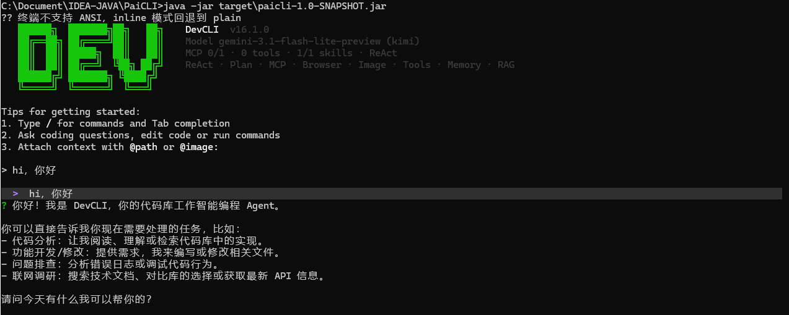

# DevCLI

## 文件删除审批

`delete_files` 使用 `paths` 数组明确列出项目相对文件路径，不递归、不展开通配符，并保留目录。每次最多 500 个文件、合计 20MB、单文件 5MB。删除前展示目标、数量、递归范围及恢复限制；审批后文件变化则整批拒绝，应用失败尝试回滚。成功删除不进入回收站，恢复依赖已有快照或备份。

删除文件达到默认 50 个的阈值必须单次确认；低于阈值仅在任务路径授权覆盖时免确认，`dontAsk` 模式下收口为拒绝。配置 `DEVCLI_DELETE_APPROVAL_THRESHOLD` 或 `-Ddevcli.delete.approval.threshold` 可调整为 1–500。检测到 Shell 删除时不复用构建测试授权或全部批准，并提示无法可靠统计目标。检测不是完整 Shell 解析；既有 `apply_patch` 仍走原审批，数量阈值只针对单次 `delete_files`，不跨调用累计。敏感路径保护不因关闭 HITL 而失效。

DevCLI 是面向代码仓库的 Java Agent CLI。它将大语言模型、工具、代码检索、任务记忆、隔离工作区、人工审批和运行恢复组织成一个本地开发运行时。

## 总体架构

```text
CLI / Runtime API / Headless
            │
            ▼
       RunCoordinator
            │
            ├── Agent                     默认 ReAct 主 Agent
            │    └── DelegationSession    按需委派的独立子 Agent
            │
            └── AgentOrchestrator         显式 /plan 编排
                 ├── PlanCoordinator
                 ├── StepExecutionCoordinator
                 ├── ReviewCoordinator
                 └── CheckpointCoordinator

共享运行时
├── AgentExecutionEngine      Agent / Turn / Tool 统一控制流
├── ToolRegistry              内置工具、MCP 工具和执行管线
├── PromptAssembler           分层提示词和上下文装配
├── MemoryManager             会话、任务和长期记忆协调
├── CodeRetriever             代码 RAG 检索
├── WorkspaceExecutionSession 隔离工作区和 PatchSet
├── McpServerManager          MCP 连接与动态工具生命周期
├── SnapshotService           Side-Git 快照与回滚
├── RunStore / TraceRecorder  运行事件与追踪
└── Renderer                  inline / plain 终端输出
```



## 请求与执行模式

### 默认 ReAct

主 Agent 负责理解需求、选择工具、推进循环和最终验收。任务需要调查、拆解、独立实现或独立复核时，主 Agent 通过 `delegate_task` 按需调用子 Agent。

默认路径不强制生成 DAG。简单任务保持单 Agent 的低延迟；复杂任务通过委派增加隔离和独立视角。

### 显式 `/plan`

`/plan` 是面向长流程的重型编排模式，适用于并行 DAG、检查点恢复、强验收和审计场景：

```text
Planner
  → ExecutionGraph / AcceptanceCriteria
  → Worker 隔离执行
  → PreReviewVerifier 确定性检查
  → Reviewer 语义建议（非阻塞）
  → PatchSet 版本校验与归并
  → Final integration
```

普通交互任务不自动切换到 `/plan`。

## 多 Agent 边界

```text
主 Agent：理解需求、分配工作、整合结果、最终验收
explorer：只读调查和证据收集
planner：只读拆解和验收设计
worker：隔离工作区中的代码修改
reviewer：只读、独立、基于证据的复核
```

子 Agent 只继承冻结的系统规则、角色提示词、显式任务和必要背景，不复制父会话、兄弟消息或长期记忆。每个子任务拥有独立的上下文历史、压缩器、Skill 副本、工具范围、资源租约、取消令牌和 `RunContext`。

委派报告由程序按项目保存，可跨用户回合通过 `report_id` / `upstream_report_id` 原文传递。`resume_report_id` 可以续接原有子任务的执行历史，重新绑定当前规则和预算；未提交补丁仅在原文件基线匹配时恢复到新隔离工作区，冲突时保留产物。Worker 报告包含修改资源、前后哈希、工具证据和副作用失败状态。

`run_in_background=true` 让主 Agent 继续处理任务，使用 `delegate_control` 查询、等待或取消。后台执行使用启动回合共享预算、有界队列和同一套权限、取消、工作区及 PatchSet 链路。Java 或根级 `pom.xml` 修改归并前必须通过编译硬检查，失败时保留候选文件；主 Agent 仍负责业务验收。存储与恢复限制见 [委派运行说明](docs/agents-reference.md#default-agent-delegation)。

主 Agent 可在 `context` / `constraints` 中显式提供选定记忆。失败子任务仍返回有界工具观察、失败尝试和未解决问题，知识发现与补丁提交状态分开；清理失败不等于已提交修改被撤销。当前会话报告缓存最多 64 条，优先保留未解决问题、已提交产物和证据，同级按最近使用淘汰；已经选作子任务输入的报告使用固定快照，不受后续淘汰影响。该策略尚不包含依赖图保留或报告向工作记忆的独立结构化晋升。

## 工具执行管线

所有工具经过统一管线：

```text
取消检查
→ 工具存在性
→ 能力范围
→ Skill 权限
→ JSON Schema 参数校验
→ HITL 审批
→ 审计记录
→ 策略判定
→ 结果尺寸治理
```

工具副作用分为：

```text
READ_ONLY → LOCAL_CONTEXT → PROJECT_MUTATION → HOST_PROCESS → EXTERNAL_MUTATION
```

每个工具在注册时显式声明契约，不再按工具名推断行为：除资源域（上面的副作用等级）外，还声明破坏性等级（`NONE` / `BENIGN` / `STRUCTURAL`）和幂等性（`IDEMPOTENT` / `NON_IDEMPOTENT`），以及能否进入短期结果缓存。只读不代表没有状态变更：已读标记、游标推进这类不可逆但无资损的流转属于 `BENIGN`，必须声明为非幂等。MCP 服务端注解默认不可信，本地只读授权只放宽访问等级，这类工具一律按 `BENIGN` + 非幂等处理。

契约直接驱动执行：只有「只读或本地上下文 + 声明幂等」的工具允许同批并行，非幂等只读工具与副作用工具一样串行；结果缓存资格由 `cacheable` 声明决定，依赖外部可变状态的只读工具显式排除缓存。

并行工具最多 4 路且保留调用顺序。参数错误、策略拒绝、命令非零退出、超时和取消都以结构化状态回传模型；命令耗时和退出码分别由执行元数据与 `CommandResultMetadata` 保留。

工具调用参数生成稳定语义指纹，用于重复动作检测、停滞提醒和硬熔断。只读结果按契约允许会话级短期缓存；副作用操作或项目切换会清理缓存。

审批风险等级与说明同样由声明的契约推导，未在本地声明契约的工具不会被描述成「安全只读」，而是按可能产生外部状态变更处理。

审批本身是三值决策，不再是「某几类工具固定必经的一步」：

```text
策略硬边界（项目根围栏 / 命令黑名单）
→ DENY   直接拒绝，不先弹一次注定被拒的审批
→ 规则层  hard_deny 直接拒绝；soft_deny / allow 按当前模式判定
→ 用户授权范围覆盖本次参数
→ ALLOW  自动放行，并输出授权理由
→ 其余
→ HITL   人工确认
```

授权只能收窄策略允许集，不能放宽，任何授权都不覆盖 `DENY`。授权分两层，两层各只有一个载体：**跨会话的持久授权**写在 `~/.devcli/config.json` 的 `permissions.allow` 规则里，表达「我长期信任这类操作」；**任务例外**由 `/grant` 给出，只作用于下一条任务（含编排轮），表达「这次需要超出常态的权限」。`/grant write` 追加授权写入项目内任意文件、`/grant write <glob>...` 追加给定项目相对路径、`/grant net <域名>...` 追加访问该域名及其子域、`/grant commands` 追加项目构建测试命令、`/grant all` 追加全部、`/grant status` 查看例外/规则层/放行缓存、`/grant off` 取消例外并清空本轮放行缓存。状态栏常驻显示规则层摘要，配置文件本身位于受保护路径名单内，Agent 的工具写路径改不动它。授权 glob 与委派写白名单共用同一套语义：项目相对路径、拒绝绝对路径与 `..`、`dir/**` 表示该目录及其所有后代。

规则层使用 `permissions.hard_deny` / `soft_deny` / `allow` / `environment`。`hard_deny` 无条件拒绝；`soft_deny` 表达可由明确用户意图解除的边界；`allow` 表达允许例外；`environment` 只提供环境事实。`auto` 模式只确定性执行 `hard_deny`，其余三类随可信意图上下文进入分类器；非 `auto` 模式按 `hard_deny` → `soft_deny` → `allow` 求值。旧键 `deny` / `ask` 不再读取。规则语法仍为 `Tool` 或 `Tool(specifier)`，工具别名在解析时归一；任一规则非法则整组拒绝，不部分接受。详见 ADR 0013。

`web_fetch` 是需要出口授权的只读工具：命中 `/grant net` 的域名自动放行（相等或其子域，不支持通配符），未授权域名逐次确认（`dontAsk` 模式收口为拒绝）；无论是否授权，`NetworkPolicy` 的 scheme 白名单与环回/内网拦截始终生效。域名取 `URI.getHost()`，即 userinfo（`@`）之后的部分，大小写与末尾点归一化，端口不参与判定。`web_search` 不按域名授权——目的地由 provider 配置决定，工具参数里没有可信资源槽——但两个工具共用同一份出口限流预算（60 秒 / 30 次），且在建连之前判定。命令类授权复用主机白名单（Maven 生命周期 / javac / 只读 Git），所以 `git push` 这类远程副作用仍然必须人工确认；`revert_turn`（批量回写整个工作区）和全部 MCP 工具没有可信的参数级资源槽，一律回到人工审批。已声明资源槽的参数是写入类工具的 `path`、`create_project` 的 `name`、`execute_command` 的 `command` 和 `web_fetch` 的 `url`。

审批的「全部放行」只在当前任务内有效：任务边界会清空按工具和按 MCP server 的放行缓存，同一条用户消息内的后续调用继续复用，下一条消息必须重新确认，不会跨任务静默放行；`/grant status` 用于查看这份缓存，`/grant off` 可以随时撤销。

任务授权另有绑定项目的可撤销作用域：并行调用与工作区 fork 共享作用域，父任务结束后授权一起失效。审计记录执行轮次、步骤、授权、工具调用和逐次审批标识，区分任务授权放行与人工批准；尚未贯通用户请求、Agent 身份与最终文件版本。

受保护路径在策略层拦截，与 HITL 开关无关、也不能被审批放行：`.git` / `.ssh` 整棵目录、`.env` 与 `.env.*`（放行 `.env.example` 这类模板）、`credentials.json` / `service-account.json` / `id_rsa*` / `id_ed25519*` 与 `.pem` / `.key` / `.p12` / `.jks` / `.keystore`。文件写入走 `resolveSafeWritePath`，所以关闭人工审批也不会让凭据或版本库元数据变成可写；`CommandGuard` 另补两条辅助规则拦截删除 `.git` 与重定向写入凭据文件（shell 能绕过文件层围栏）。`target` / `node_modules` 仍只是物化排除项，不是安全边界。

Agent 自身配置单独保护：`.devcli/hooks.json`、`.devcli/mcp.json`、`.devcli/config.json`，以及 `devcli.hooks.file` / `DEVCLI_HOOKS_FILE` 指向的自定义 Hook 文件。共享文件写入入口与 PatchSet 提交前拒绝修改，任务授权、全部批准和关闭审批通道均不能覆盖；快照恢复跳过这些配置并提示。检查覆盖默认用户配置、物理路径别名及隔离工作区对应的主项目路径，普通 `.devcli` 文件和配置示例仍可修改。需要调整时由用户在 Agent 工具之外操作。**这不是操作系统写保护：主机命令、外部 MCP 服务、配置引用的脚本尚未统一限制；没有实现完整防注入或默认命令沙箱。**

`execute_command` 实际走主机后端时，在启动进程前强制单次确认，包括普通主 Agent 和显式 `HOST_RESTRICTED/HOST_WARN` 的隔离任务。此规则优先于命令任务授权和全部批准；关闭审批通道或没有审批处理器时拒绝主机执行，不自动放行。**主机路径同样经过规则层与模式层，但只吸收收紧方向**：`deny` 规则立即拒绝、`dontAsk` 模式收口为拒绝；`allow` 规则与 `bypassPermissions` 不参与，因为主机单次确认刻意不可被放宽类判定免除（比 WorkBuddy 的全局 bypass 更严）——代价是 `allow execute_command(...)` 在主机路径上不生效，启动时会打印告警并提示改用 `deny`。隔离路径走沙箱后端，规则层与模式层正常求值。弹窗展示主机风险、工作目录和完整的脱敏命令，控制字符转义；仅接受 `y`，回车默认拒绝，不允许批量批准、修改参数或脱敏后执行。批准绑定本次命令、目录及后端，取消或过期后不启动进程，单独记录关联调用的审批事件。Docker 工具路径沿用原审批规则。**这是工具入口的授权强化，不是沙箱：批准后的主机命令仍可修改配置；内部 Pre-Review 和外部 MCP 服务不经过这次新增门禁。**

`/mode plan` 让只读能力上限持续作用于后续轮次：写入、命令和外部副作用工具既不注入模型也不会执行。与 `/plan` 组合时该轮会被直接拒绝（编排必须写入隔离工作区，跑到中途只会得到一片能力拒绝），并消费掉只读标记。`/mode default` 恢复逐个询问。

`/mode auto` 把「默认要问」的动作交给权限分类器判断：只有走完整条求值链、没有任何规则或安全机制要求询问的动作才会送到分类器。显式 `ask` 规则、`delete_files` 删除确认、可识别的 Shell 删除、`apply_patch` 删除或移动、`revert_turn`、浏览器与 MCP 逐次审批都不经过分类器——它们有独立于默认策略的询问理由。分类器只看到工具名、参数、项目路径与当前模式，不继承会话历史与记忆；默认超时 10 秒（`devcli.permission.classifier.timeout.seconds`），执行前会确认工具剩余预算足以覆盖该超时，不足、装配缺失、超时、调用失败或响应不可解析一律拒绝，不猜测。连续失败次数在主 Registry 与项目 fork 间共享，默认达到 3 次（`devcli.permission.classifier.failure.threshold`）后退出 `auto` 并回落 `default`；手动切换模式会重置该计数。提示词在 `prompts/permission-classifier.md`，仅允许 `~/.devcli/prompts/` 的可信用户级覆盖；项目 `.devcli/prompts/permission-classifier.md` 会被忽略，避免仓库内容改写自身审批策略。**分类器误判放行时没有人工兜底**——fail-closed 只兜住「分类器不可用」，兜不住「分类器判断错误」，这是 `auto` 相对 `default` 的固有代价。分类器不覆盖规则层 `allow`：用户写了 `allow` 就是用户的选择；代价是无 specifier 的宽泛 `allow` 会让分类器在该工具上完全不参与。

能力范围与任务级授权都随轮次生效并被编排继承：能力范围只能单调收窄（只读 ⊂ 隔离项目 ⊂ 完整），嵌套调用与隔离 fork 都不能放宽外层约束；波次线程池在轮次内新建，因此继承本轮的范围与授权，长生命周期线程池在轮次外创建，不会残留某一轮的约束。

## Prompt 与上下文

Prompt 按稳定性分层：

```text
base
→ personality
→ mode
→ approval
→ project_context
→ skills
→ context_management
→ handoff
```

稳定层前置、易变层后置，以提高模型前缀缓存命中。模型上下文由 `ContextProfile` 和 `TokenBudget` 共同治理，不使用固定字符数代替 Token 预算。

上下文压缩只负责当前运行窗口：达到触发阈值后先做 microcompact 确定性淘汰（只回收内容指纹重复、或同一路径已被更晚写入覆盖的工具结果），历史摘要按预算维护，文件引用、工具证据、失败尝试和下一步动作以结构化恢复段保留。压缩上下文绑定项目、会话、epoch 和 Runtime 事件范围；摘要与降级截断都经过事实闸门，事实补回后再次校验最终预算。压缩不会改变任务状态、长期记忆或工作区状态。

`/compact` 主动压缩旧对话，默认保留最近 1 轮原文；`/compact --keep N` 指定保留轮次，`N=0` 压缩全部原文轮次。摘要请求在预算允许时复用会话前缀与工具定义，工具调用不会执行；增量更新仍只读取新增消息和旧摘要索引。Anthropic 默认启用自动 Prompt Cache，兼容端点不支持时设置 `DEVCLI_ANTHROPIC_PROMPT_CACHING=false`。

## Skill 系统

Skill 是可路由、可验证、可维护的知识单元，不是默认注入的长手册：

```text
Skill 索引
  → 任务相关选择
  → load_skill 分页加载
  → reference 按需读取
  → allowedTools 限制工具
  → 记录实际激活
```

Skill 来源分为 builtin、user 和 project 三层。project Skill 默认不可信，必须显式信任；其正文带有不可信参考资料边界，不能覆盖系统规则、提升权限或改变执行结构。

推荐的 Skill 内容边界：

```text
SKILL.md       触发条件和导航
rules/         稳定约束
workflows/     可执行流程
references/    代码地图和详细资料
gotchas/       已验证的高成本陷阱
scripts/       确定性检查
```

索引展示、正文激活和 reference 激活分别统计，区分“被列出”和“真正改变了任务行为”。

## 记忆分层

```text
conversationHistory + RollingSummary  当前线程上下文
SessionMemory                         当前任务运行投影
LongTermMemory                        跨任务稳定事实
```

`SessionMemory` 保存本任务的待办、当前工作、下一步动作、工具证据和失败尝试，不跨进程持久化。长期记忆采用 CodeBuddy 风格的主题 Markdown：全局记忆与项目记忆物理分目录存储，项目同名主题在召回时覆盖全局版本。

Git 主工作区、关联工作树和仓库子目录共用主工作区根路径对应的项目记忆；嵌套独立仓库仍独立，普通目录沿用绝对路径。绑定旧工作树目录时，旧主题复制到共享目录，保留源文件；同名不同内容保留共享版本并在 `/memory` 状态中显示冲突数量。处理成功后记录一次性完成标记，删除或清空记忆不会再次导入旧内容。详见 [项目记忆作用域](docs/adr/0016-Git工作树共享项目记忆.md)。

每个作用域的 `MEMORY.md` 是可从主题文件重建的派生索引；默认启用 LLM 相关性选择器，候选清单最多 4096 tokens，并且模型只能选中实际发送的候选，命中后才读全文。主题 frontmatter 保存类型、创建/更新时间、修订号和可选有效期；过期条目仍可审计，但不参与索引与召回。

`/save` 和 `save_memory` 是明确写入入口，普通消息不自动落盘。自动写入遇到同主题不同内容时保留原文，用户显式保存才会生成新修订；敏感内容拒绝写入并要求脱敏后重试。详见 `docs/adr/0007-长期记忆对齐-workbuddy.md`。

升级时会把旧版 `records/` 记忆卡幂等复制到全局作用域；全部处理成功后写入一次性迁移完成标记，后续构造不再重复解析保留的旧卡片。旧文件保留，不做删除；旧格式没有可靠的项目归属，因此不会猜测并迁入某个项目。

## 代码 RAG

```text
JavaParser / 文件分块
  → keyword + semantic + bounded graph
  → RRF 倒数排名融合
  → symbol-aware boost
  → CrossEncoder rerank
```

索引按文件 generation 和项目 epoch 管理并发。增量索引先写入影子表，通过 CAS 校验后原子提升；旧 epoch 结果不可见。检索结果标记 `CURRENT`、`STALE` 或 `DIRTY`，必要时回读实时文件校验。代码归约会保留 diff、符号、编译位置及 RAG/index/classpath 版本元数据。

`search_code` 负责语义、符号和关系检索；`grep_code` 是独立的精确定位工具，用于类名、方法名、配置键和固定文本。

`grep_code` 的搜索范围按 git 的忽略规则确定：git 仓库使用 `git ls-files --cached --others --exclude-standard`，嵌套 `.gitignore`、否定模式和全局 excludes 都由 git 负责；非 git 目录、git 不可用或命令失败时回落到目录遍历，只用硬编码跳过目录兜底。显式把 `path` 指向被忽略目录时回落遍历，不会因为忽略规则而搜不到。

## 隔离工作区与 PatchSet

副作用任务使用可替换工作区后端：Git worktree、文件系统写时复制或有界复制。敏感文件、符号链接、路径逃逸和工作区边界由统一策略控制。

```text
Worker 工作区
  → 文件内容与权限快照
  → beforeHash / afterHash
  → 资源租约与版本检查
  → 项目锁 + 跨进程文件锁
  → 原子应用 PatchSet
  → 失败回滚或 checkpoint
```

同一文件不允许多个运行中步骤并发写入。未通过版本检查、Pre-Review 硬检查、策略或确定性验收的补丁不会写入主项目。

写租约同时受空闲超时（默认 30 秒）和绝对期限（默认 10 分钟）约束，持续续租不延长绝对期限，到期必须重新竞争。

命令默认在禁网、只读根文件系统的 Docker 沙箱执行；`HOST_RESTRICTED`（兼容 `HOST_WARN`）是显式主机白名单模式，不作为自动降级路径。它不提供操作系统隔离：Maven 项目插件、构建脚本和 javac 注解处理器仍可执行任意主机代码，仅适用于可信项目。Maven 本地仓库路径只接受显式配置的绝对目录。

## Reviewer 与验收

确定性验证和模型评审分层：

- 编译、测试、哈希、权限和版本校验由工具负责；
- Reviewer 负责静态和语义核对；Pre-Review 硬检查实际通过后，其结论作为非阻塞建议；
- 验收标准声明验证方式、验证器和适用节点；
- 编译、测试等确定性问题阻断，LLM 评审问题进入 advisory；
- 缺少真实工具证据时不能伪装为通过。

默认 ReAct 委派只在高风险条件下触发独立 Reviewer，例如大范围修改、关键安全资源或副作用工具失败。Reviewer 可以配置独立模型；配置不可用时失败关闭。

## 运行时、恢复与观测

CLI、Runtime API、后台任务和无头执行都通过 `RunCoordinator` 创建独立 `RunContext`。同一 thread 的 turn 串行执行，不同 thread 可以并行。

执行内核输出强类型 `RunEvent`，覆盖模型调用、工具执行、结果配对、取消、预算退出、失败和完成。`RunStore` 保存运行生命周期，`TraceRecorder` 按 `runId` 写入结构化 trace。

Checkpoint 保存执行图、执行产物、验收元数据、PatchSet 写前日志、文件权限、步骤身份、失败摘要和重做额度，不保存完整的 SubAgent 对话对象图。压缩边界另外持久化稳定快照引用、快照 checksum、来源事件范围和 projection hash；恢复时重建原拓扑并逐项校验，不直接信任旧工作区或旧摘要。

图片输入与压缩只保留图片字节的 SHA-256、来源、MIME 和尺寸等确定性元数据；OCR/视觉摘要未配置时不伪造描述文本，也不使用描述文本计算图片身份。

失败统一提供原因、分类、下一步动作，以及重试、人工接手、接受部分结果和回滚选项。

## AgentDojo 公开数据评测

`benchmarks/agentdojo/run-paired.ps1 -BatchRoot <新目录>` 使用固定版本 AgentDojo 原始任务，经 `AgentSessionRuntime`、生产 MCP、`ToolExecutionPipeline` 执行后交由官方 evaluator 评分。来源、四道任务、Luna 模型、预算、执行顺序及产物哈希在启动前写入 `manifest.json`；已存在的批次和条件目录拒绝复用。

驱动保留 `search_tools` 和 `read_tool_result`，未预激活的工具仍通过生产发现链路启用。显式短词和中文查询不会被停用词过滤；整句预激活单独过滤噪声词。测试源码与单元测试分目录。

MCP 参数保留 `anyOf` / `oneOf` 联合类型，允许 schema 声明的 `null`，不放宽非法类型。修复后的受影响题目可通过 `-CaseId <任务组合标识>` 单独建立新批次，不重跑或混合其他题目。

默认 `-ApprovalPolicy auto-approve` 仅诊断任务效用和审批开销，不能证明安全提升。`terminal` 复用生产人工审批；baseline 同样经过生产执行管线，仅旁路 HITL。本实验不覆盖 Docker 沙箱、PatchSet 或文件回滚，旧批次不得合并为正式总体成绩。

治理主指标为官方攻击成功率 `ASR = attack_success / 有效攻击样本 × 100%`，越低越好；同时报告官方任务效用 `Utility = utility / 有效任务样本 × 100%` 及 `baseline ASR − treatment ASR`（百分点）。百分比必须附样本量、审批策略和外部失败数；两侧均无成功攻击不等于证明治理有效。

## 上下文压缩问答评测

`scripts/swe-bench-multilingual-java.ps1` 的 `-ConversationProtocol original-task-qa` 固定要求：Luna（不可用时记录实际回退模型）、公开原始 Issue、solo、compact-only、64000 Token 阈值、默认 20 轮（以实际达到阈值为准）。同一 Issue 的多轮复用同一 `AgentSessionRuntime`，首轮不追加源码包，后续问题覆盖需求、诊断、实现、验证及证据回顾；禁止自定义大文本替换任务。每题独立工作区，逐轮真实问答与历史窗口记录在 `conversation.jsonl`。

最终补丁仍由 `scripts/score-swebench-official.ps1` 调用官方 harness。`scripts/summarize-swebench-context.py --compact-only` 输出 resolved、F2P、P2P 的百分比，另列实际触发模型压缩的样本比例及该子集的质量；没有触发时压缩后质量为 `null`，不能用普通任务成功代替压缩效果。微压缩、摘要 Token 和耗时单独记录；没有 raw 对照时不计算相对质量保持率。该固定问答协议是公开任务上的多轮实验，不冒充默认单轮榜单。

微压缩仅在恢复引用比原工具结果更省 Token 时替换并落盘；短确认结果保持原文，避免清理后窗口反而增大。

## 设计原则

1. 主 Agent 负责决策和最终验收，子 Agent 只承担边界清晰的子任务。
2. 默认路径轻量，复杂能力按需启用。
3. 模型负责理解和生成，程序负责权限、状态、证据和一致性。
4. 读取、修改、验证、归并和恢复拥有明确边界。
5. 被加载不等于已生效，模型声明成功不等于任务验收通过。
