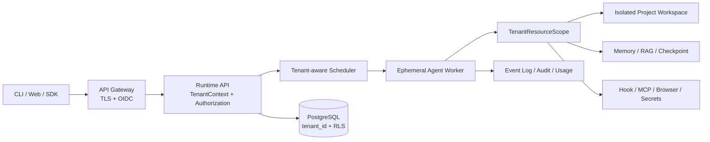

# DevCLI 多用户与多租户会话隔离设计

## 状态

- 日期：2026-08-14
- 状态：设计完成，尚未实施
- 适用范围：Runtime API 服务端模式
- 当前结论：现有实现属于单一可信本地用户下的多会话隔离，不能作为多租户安全边界

## 1. 设计决策

DevCLI 保留两种明确分离的运行模式：

- `local`：默认模式，使用内置本地租户和本地用户，继续支持 SQLite、当前项目目录和本机凭据。
- `server`：多用户模式，强制启用身份认证、租户授权、服务端存储、租户资源范围、配额和沙箱。

`server` 模式缺少任何强制依赖时必须拒绝启动，不允许静默回退到 `local` 语义。

多用户能力遵守以下不变量：

1. 每个请求都有经过验证的租户和用户身份。
2. 每个持久化查询和内存键都携带租户范围。
3. 每个工具只能访问当前租户授权的项目、凭据和外部连接。
4. 会话连续性来自事件日志、检查点和显式消息快照，不依赖 JVM 对象寿命。
5. 同一会话严格串行，不同租户之间实施公平调度和独立配额。
6. 默认拒绝跨租户访问，资源标识不能承担授权职责。
7. 工作区、Hook、MCP 和进程内对象隔离不能替代容器或进程安全边界。

## 2. 当前能力与缺口

### 2.1 已有能力

- 每个 Runtime thread 分别维护 Agent、对话历史、双通道输入队列和取消状态。
- 事件、分支、检查点和会话投影已经按 thread 和 branch 组织。
- 同一 thread 通过串行执行器避免 Turn 并发执行。
- 每个会话创建独立 ToolRegistry 和 Agent 实例。
- Hook 已覆盖 agent、turn、message 和 tool execution 生命周期。
- Hook 调用继续经过工具参数校验、权限、HITL、策略和审计管线。

### 2.2 主要缺口

- Runtime API 只有一个全局 API Key，没有租户主体、用户主体和资源归属校验。
- Runtime 存储、后台任务和会话投影没有 `tenant_id`。
- 会话缓存、串行执行和取消仅以 `threadId` 为键。
- Runtime 使用固定项目根目录和共享模型配置。
- 长期记忆、审计目录及部分扩展配置使用全局本机目录。
- 线程标识长度和随机性不能代替授权检查。
- 进程内串行器不能防止多个 Runtime 实例同时执行同一会话。
- 不同会话直接修改同一项目时，缺少跨会话的统一提交事务。
- Hook 上下文没有租户、用户、项目、线程和 Turn 身份。
- Hook 配置当前允许忽略无效文件，不符合服务端失败关闭要求。

## 3. 领域模型

```text
Tenant
  -> Membership -> User
  -> Project
       -> Thread
            -> Branch
            -> Turn
                 -> RunEvent
                 -> ToolInvocation
                 -> HookInvocation
                 -> Artifact
```

核心身份类型：

```text
TenantContext(
  tenantId,
  userId,
  roles,
  requestId,
  authenticationMethod
)

SessionKey(
  tenantId,
  projectId,
  threadId
)
```

建议权限模型：

- `TENANT_ADMIN`：管理成员、项目、配额和租户级策略，不默认获得私有会话正文权限。
- `PROJECT_MEMBER`：在被授权项目中创建会话和执行任务。
- `THREAD_OWNER`：管理自己的会话、分支、输入队列和取消操作。
- `THREAD_EDITOR`：经过显式共享后追加输入和执行 Turn。
- `THREAD_VIEWER`：只读会话投影和事件。
- `THREAD_AUDITOR`：根据组织策略读取审计信息，不自动获得工具结果正文。

会话默认私有。共享必须通过显式授权记录完成，禁止根据“同一租户”自动开放所有会话。

## 4. 总体架构



控制面负责认证、授权、队列、租约、状态和事件。执行面只接受完整的租户资源范围，在临时 Worker 中运行 Agent 和工具。

## 5. 认证与授权

### 5.1 身份来源

- 人类用户使用 OIDC Authorization Code + PKCE。
- 自动化调用使用高熵服务令牌，服务端只保存令牌摘要，并映射到租户、用户和权限范围。
- Runtime 只接受网关或认证组件生成的可信主体。
- 请求中的 `tenantId` 只能用于选择用户已有成员关系，不能直接决定数据范围。

### 5.2 授权规则

所有 API 操作先执行以下检查：

1. 认证主体有效。
2. 主体属于目标租户。
3. 项目属于目标租户，且主体拥有项目权限。
4. thread、branch、turn 和 task 属于同一租户及项目。
5. 主体拥有当前动作要求的会话权限。

跨租户或无权限资源统一返回 `404`。日志内部保留真实拒绝原因，外部响应不暴露资源是否存在。

## 6. 数据模型与存储

服务端模式使用 PostgreSQL。SQLite 只承担本地模式，避免把单连接和单进程锁语义扩展为服务端一致性承诺。

需要租户化的主要数据：

| 数据 | 建议主键或唯一范围 |
| --- | --- |
| projects | `(tenant_id, project_id)` |
| threads | `(tenant_id, thread_id)` |
| thread_grants | `(tenant_id, thread_id, principal_id)` |
| branches | `(tenant_id, thread_id, branch_id)` |
| events | `(tenant_id, thread_id, branch_id, sequence)` |
| checkpoints | `(tenant_id, thread_id, branch_id, covered_sequence)` |
| queues | `(tenant_id, thread_id, branch_id, sequence)` |
| projections | `(tenant_id, thread_id, branch_id, projection_version)` |
| durable_tasks | `(tenant_id, task_id)` |
| memory_facts | `(tenant_id, scope_type, scope_id, fact_id)` |
| rag_indexes | `(tenant_id, project_id, revision)` |
| audit_events | `(tenant_id, audit_id)` |
| usage_ledger | `(tenant_id, turn_id, usage_type)` |

即使子表可以通过 thread 反查租户，也应显式保存 `tenant_id`，并通过复合外键和 PostgreSQL Row Level Security 提供第二层防护。

事件序号应在会话或分支范围内单调递增，不能把数据库全局自增 ID 当作会话版本。所有修改接口使用期望版本或 fencing token 防止旧 Worker 提交结果。

### 6.1 大对象

工具大结果、工作区快照和补丁备份进入对象存储或租户专属文件根目录，定位符至少包含：

```text
tenantId / projectId / threadId / turnId / artifactId
```

模型可见预览和完整 Artifact 都必须保持相同租户范围。外部下载使用短期签名地址，禁止直接暴露宿主机路径。

### 6.2 迁移

1. 增加 schema 版本和内置 `local` 租户、用户、项目。
2. 将现有 thread、event、checkpoint、queue、projection 和 task 回填到 `local`。
3. 所有领域接口先强制接收 TenantContext，再开放服务端入口。
4. 迁移完成前保持 `local` 模式，不允许多用户访问旧表。

## 7. 会话运行模型

当前每个 thread 长期持有 AgentSessionRuntime。服务端模式应拆分为：

- `SessionCoordinator`：维护队列、活动 Turn、取消句柄和会话租约，可缓存并设置闲置过期时间。
- `TurnRuntime`：每个 Turn 创建 Agent、ToolRegistry、MemoryManager 和 HookLifecycle，结束后关闭。

标准执行流程：

```text
authenticate
-> authorize project and thread
-> acquire SessionKey lease
-> load checkpoint and replay completed events
-> snapshot model-visible history
-> create tenant-scoped TurnRuntime
-> execute Agent and tools
-> append terminal events and usage
-> persist projection/checkpoint
-> release lease and close TurnRuntime
```

同一 thread 只允许一个活动 Turn。Steering 和 Follow-up 进入持久队列，由活动 Turn 在协议边界消费。取消操作必须同时匹配租户、线程和活动 Turn。

每次创建 Turn 接受 `Idempotency-Key`，唯一范围为 `(tenantId, userId, idempotencyKey)`。客户端重试只能取得已有 Turn，不能重复执行副作用。

模型实际看到的用户消息、内部消息、插件消息、转向消息、工具结果和压缩边界必须进入可恢复事件。checkpoint 只是投影缓存，不能成为唯一事实来源。

## 8. 项目与工具隔离

### 8.1 TenantResourceScope

每个 Turn 构造不可变资源范围：

```text
TenantResourceScope(
  tenantContext,
  sessionKey,
  projectRoot,
  workspaceRoot,
  credentialScope,
  memoryScope,
  ragScope,
  auditScope,
  toolPolicy,
  runBudget
)
```

禁止工具从系统属性、全局静态字段或进程工作目录回退获取租户资源。

### 8.2 工作区事务

服务端所有项目修改都进入隔离工作区：

1. 从授权项目版本创建快照。
2. 工具只读写临时工作区。
3. Turn 结束后生成 PatchSet。
4. 在 `(tenantId, projectId)` 提交锁内校验基线哈希。
5. 冲突时拒绝提交并返回结构化冲突，不做最后写入者覆盖。
6. 应用成功后再更新事件、Artifact 和 WorkingMemory。

ReAct、Plan 和 Multi-Agent 必须使用同一提交协议，不能只隔离 Plan/Team。

### 8.3 强隔离

不可信命令和第三方扩展进入独立容器或进程：

- 非 root 用户。
- 只挂载当前租户工作区。
- 默认禁网，按策略开放目标域名。
- 限制 CPU、内存、进程数、磁盘和执行时间。
- 禁止挂载宿主机凭据、Docker socket 和其他租户目录。

JVM 内对象隔离、PathGuard、Git worktree 和文件租约用于正确性控制，不作为恶意租户的安全边界。

## 9. 记忆、RAG、密钥与扩展

### 9.1 记忆

- `USER_PRIVATE`：默认长期记忆范围，只对当前用户开放。
- `PROJECT_SHARED`：需要显式策略允许，仅在同一租户项目内召回。
- `TENANT_SHARED`：只允许受控知识，不接收普通对话自动写入。

WorkingMemory、SessionMemory 和完整对话始终为 thread 范围。任何召回查询都必须先应用租户和范围过滤，再进行向量或关键词排序。

### 9.2 RAG

CodeRetriever、向量索引、图索引、negativeFact 和缓存键统一包含租户、项目及索引版本。不可仅依赖项目路径字符串区分租户。

### 9.3 密钥

模型、MCP 和外部服务凭据由密钥服务按租户或用户返回短期引用。RunEvent、Hook 参数、审计和错误消息不得保存密钥正文。

### 9.4 MCP 与浏览器

- 服务端第一阶段禁用用户自定义 stdio MCP。
- 管理员批准的 MCP 仍需使用租户专属连接或租户身份转发。
- 有状态 MCP 进程不得跨租户共享。
- Browser/CDP 会话按用户和 thread 隔离，关闭 Turn 或超时后回收。
- 所有 MCP、Browser 和 Web 工具继续受租户预算、网络策略和审计约束。

## 10. Hook 决策

### 10.1 是否需要 Hook

项目不需要再实现一套 Hook。当前已经具备完整的受控 Hook 基础：

- agent、turn、message、tool execution 四层开始和结束事件。
- 幂等生命周期闭合。
- Hook 调用与结果成对事件。
- 稳定 Hook id、调用 id、耗时、状态和决策。
- `BLOCK > WARN > CONTINUE` 决策合并。
- 生命周期结束前等待后台 Hook。
- Hook 只能调用 ToolRegistry 已注册工具。
- 副作用 Hook 需要显式允许、启用 HITL，并命中逐次审批策略。

因此正确方向是保留现有 Hook，并完成服务端租户化。禁止新增第二套回调框架或允许任意 shell/HTTP Hook。

### 10.2 Hook 的职责边界

Hook 适合：

- 运行审计补充。
- 指标和追踪上报。
- 租户自定义只读检查。
- 受控通知。
- 结果发布和外部工单集成。

Hook 不得承担：

- 身份认证和租户解析。
- 资源归属授权。
- 数据库租户过滤。
- 项目路径隔离。
- 核心配额扣减。
- Turn 终态持久化。
- PatchSet 冲突校验。

这些能力必须由确定性核心代码强制执行。`required` Hook 可以阻断业务流程，但不能成为唯一安全检查。

### 10.3 多用户模式所需改造

1. HookContext 增加 `tenantId`、`userId`、`projectId`、`threadId`、`turnId` 和 `requestId`。
2. 占位符采用显式白名单，默认不提供用户输入、工具原文、密钥和文件正文。
3. 配置来源调整为 `platform -> tenant -> project`，同 id 后者覆盖前者，并保存来源、版本和摘要。
4. `server` 模式禁止自动读取进程用户的 `~/.devcli/hooks.json`。
5. 仓库中的 `.devcli/hooks.json` 视为不可信内容，必须经过租户管理员批准后才能启用。
6. 无效 Hook 配置在服务端启动或配置发布阶段直接拒绝，禁止记录警告后静默忽略。
7. 每个 Turn 冻结 Hook 配置快照，运行中配置变更只影响后续 Turn。
8. Hook 使用当前 Turn 的 tenant-scoped ToolRegistry、RunContext、工作区和凭据范围。
9. 副作用审批必须发送给发起用户或被授权审批者，禁止复用全局终端 HITL。
10. Hook 调用次数、并发、工具超时、输出大小和费用计入租户预算。
11. Hook 审计事件增加租户、用户、线程、Turn、配置版本和处理器来源。
12. Worker 关闭前等待 Hook 完成；超时后按 failureMode 产生明确终态，不遗留后台操作。

### 10.4 服务端默认策略

- 平台 Hook：仅平台管理员配置，可用于审计和基础可观测性。
- 租户 Hook：仅租户管理员配置，默认只允许 READ_ONLY 和 LOCAL_CONTEXT 工具。
- 项目 Hook：默认禁用，需要显式批准配置摘要。
- 用户 Hook：服务端第一阶段不提供，避免同一项目中权限语义过度复杂。
- 任意命令 Hook：不提供。

## 11. API 设计

建议资源路径：

```text
POST   /v1/projects/{projectId}/threads
GET    /v1/threads/{threadId}
POST   /v1/threads/{threadId}/turns
POST   /v1/threads/{threadId}/steer
POST   /v1/threads/{threadId}/follow-up
POST   /v1/threads/{threadId}/cancel
GET    /v1/threads/{threadId}/events
GET    /v1/threads/{threadId}/branches
POST   /v1/threads/{threadId}/branches
POST   /v1/threads/{threadId}/grants
DELETE /v1/threads/{threadId}/grants/{grantId}
```

租户身份不放入普通资源路径，由可信认证主体决定。SSE 建立连接时检查权限，并在令牌过期、成员关系撤销或会话授权变化后关闭连接。

写请求记录 requestId、actorId 和 idempotency key。取消、分支切换和授权变更都生成可审计事件。

## 12. 配额与公平调度

至少提供以下租户级限制：

- 活动 Turn 数量。
- 排队 Turn 数量。
- 每个 thread 的输入队列长度。
- LLM 请求数、Token 和费用。
- 工具调用数及并发数。
- Hook 调用数。
- Worker 执行时间。
- 工作区和 Artifact 存储量。
- MCP、Web 和 Browser 外部请求数。

调度器按租户轮转或加权公平执行，先检查租户配额，再进入全局 Worker 池。禁止单个租户占满全部执行线程和队列。

多节点下的 Session lease 必须包含 fencing token。旧 Worker 即使恢复运行，也不能提交事件、PatchSet 或终态。

## 13. 可观测性与审计

统一关联字段：

```text
tenant_id
user_id
project_id
thread_id
branch_id
turn_id
run_id
request_id
tool_call_id
hook_invocation_id
```

审计记录保留决策和摘要，不默认保存完整提示词、文件正文、密钥和图片。平台运维指标与租户正文分开存储，运维角色不能因读取指标而获得会话内容。

## 14. 实施阶段

### 阶段 1：租户类型与本地兼容

- 引入 TenantContext、SessionKey 和 TenantResourceScope。
- 创建内置 `local` 租户、用户和项目。
- 移除领域层只接收裸 threadId 的入口。

### 阶段 2：认证和存储范围化

- 增加认证与授权中间层。
- 完成 Runtime 数据和后台任务租户化。
- 所有跨租户访问默认拒绝。
- 完成旧数据迁移和回滚方案。

### 阶段 3：会话执行重构

- 拆分 SessionCoordinator 与 TurnRuntime。
- 串行键、取消、队列和事件统一改用 SessionKey。
- 增加幂等 Turn 和版本化提交。

### 阶段 4：资源与 Hook 租户化

- 隔离工作区、长期记忆、RAG、审计、Artifact 和凭据。
- 扩展 HookContext，改造配置来源和用户审批路由。
- 服务端关闭未批准 MCP、Hook 和宿主机命令入口。

### 阶段 5：服务端执行面

- 引入临时 Worker 和容器资源限制。
- 统一 ReAct、Plan、Multi-Agent 的工作区事务和 PatchSet 提交。
- 增加租户公平调度、配额、lease 和 fencing token。

### 阶段 6：安全验收

- 完成跨租户攻击矩阵。
- 完成崩溃恢复、重复请求和多节点并发测试。
- 完成路径逃逸、符号链接、MCP、Hook、浏览器和凭据隔离测试。
- 验收通过后再允许外部网络访问 `server` 模式。

## 15. 测试矩阵

必须覆盖两个租户使用相同 project、thread、branch、task 和 idempotency 标识的场景，验证复合范围不会串线。

| 场景 | 预期 |
| --- | --- |
| A 读取 B 的 thread、event、projection | 404 |
| A 向 B 的 thread 追加、转向、跟进 | 404，B 队列不变化 |
| A 取消 B 的 Turn | 404，B 继续运行 |
| A 创建或激活 B 的 branch | 404 |
| A 恢复 B 的 checkpoint | 不可见 |
| A 的长期记忆被 B 查询 | 无召回结果 |
| A 的 RAG、缓存和 spill locator 被 B 使用 | 拒绝 |
| A 的 Hook 配置在 B 的 Turn 执行 | 不执行 |
| A 的 MCP、Browser 和模型凭据被 B 使用 | 拒绝 |
| 两个 Worker 同时提交同一项目 | 一个成功，另一个得到结构化冲突 |
| 旧 Worker 在 lease 失效后提交 | fencing token 拒绝 |
| 单租户占满队列 | 其他租户仍获得调度机会 |
| Runtime 重启 | 权限、队列、事件和终态保持一致 |

## 16. 完成标准

多用户隔离只有同时满足以下条件才算完成：

- 租户 A 即使获得租户 B 的资源标识，也不能读取、修改、取消或推断资源存在。
- 会话、记忆、RAG、缓存、Hook、MCP、Browser、审计和文件系统不存在跨租户旁路。
- 同一会话在单节点和多节点场景都保持串行和幂等。
- Worker 崩溃、超时、重试和租约失效不会重复应用副作用。
- `local` 模式保持现有单用户行为，`server` 模式缺少安全依赖时失败关闭。

## 17. 非目标

- 本设计不实现管理后台界面。
- 本设计不定义计费产品和价格策略，只要求记录可核对用量。
- 本设计不使用 Hook 替代核心认证、授权和一致性逻辑。
- 本设计不要求本地 CLI 引入 PostgreSQL、容器编排或企业身份系统。
- 本设计不承诺第一阶段支持用户自定义 MCP、用户级 Hook 或实时多人共同编辑同一会话。

## 18. 关联文档

- `docs/phase-20-runtime-api.md`
- `docs/runtime-resource-lease-design.md`
- `docs/design-notes/08-sandbox-execution-security-design.md`
- `docs/design-notes/10-production-scale-durable-runtime-design.md`
- `docs/agents-reference.md`
